# kubevc

### 목차
- 확인 사항
- 사전 설정
- kubectl 명령어
- kubernetes tool version
- Monitoring tool
- 사용 모델
- 사용 환경
- 스크립트 사용 설명서

## 확인 사항

- 스크립트는 1번부터 순차적으로 실행.
  - 4번 스크립트의 경우 `4_deploy_model.sh` 실행 후 `4_deploy_tfserving.sh` 실행(k3s의 경우 `4_deploy_model.sh` 실행 후 `4_deploy_tfserving_k3s.sh` 실행)
  - 단, `nfs_server_install.sh` 스크립트는 4번 스크립트 실행 전에 실행해야 함.
    - TFServing 배포 전 NFS 서버 구성이 먼저 완료 되어야 함.
  - k3s 설치 진행 시 `nfs_server_install.sh` 실행 후 `nfs_models.dir_mount_k3s.sh`을 실행해야 함.
- 모든 노드(마스터노드, 워커노드)의 `Hostname`은 서로 달라야 함.
  - 노드의 `Hostname`이 동일할 시 클러스터에 가입이 안됨.
  - `Username`은 동일해도 상관 없음.
- 사용자(user)가 sudo 권한을 받아둬야 함.(sudo 사용시 nopasswd 설정 필요)
  - 사전 설정에 서술
- Agent : 스크립트를 실행 할 컴퓨터
- `1_environment_setup_localhost`만 모든 노드에서 실행.
    - `1_environment_setup_localhost`를 제외한 스크립트는 모두 Agent에서 실행.
- `Public IP`를 입력할 때, `DNS`를 입력하면 진행되지 않음. 꼭 `IP`를 입력해야함.
- `_k3s`는 k3s를 설치할 때 사용 


## 사전 설정

### SSH 설정

- 모든 노드에 Agent의 ssh public key가 등록되어 있어야 함. ex) id_ed25519.pub
    - 등록 방법 예시
    1. agent에서 ssh-key 생성: `ssh-keygen -t ed25519`
    2. agent의 `$HOME/.ssh` 디렉토리에서 `cat id_ed25519.pub` 입력 후 출력문 복사
    3. 이후 노드의 `$HOME/.ssh` 디렉토리 내 `authorized_keys`에 복사한 것을 입력 후 저장.
    - 노드 접근 방법: `ssh -i $HOME/.ssh/id_ed25519 [사용자(user)]:[node의 ip] -p [ssh port(default:22)]` ex) `ssh -i $HOME/.ssh/id_ed25519 kubevc@192.168.0.100 -p 22`
- `/etc/ssh/sshd_config` 에서 `PubkeyAuthentication yes`, `PasswordAuthentication no`로 설정. (모든 노드 공통 사항)
    - PasswordAuthentication는 보안상 추천하지 않으므로 스크립트는 PubkeyAuthentication을 사용하는 것을 전제로 함.
    - 예시: example 디렉토리 내 sshd_config 확인
- 위 설정 완료 후 `systemctl restart sshd`

### sudo 설정(Node)

- 모든 노드에서 진행
- `sudo visudo`로 sudoers 설정 열기.
-  User privilege specification
 아래에 `[사용자(user)] ALL=NOPASSWD: ALL` 입력 후 저장

ex)
```
...
# User privilege specification
root    ALL=(ALL:ALL) ALL
ddps ALL=NOPASSWD: ALL
```

- 위 설정 이후 `sudo vi /etc/group`로 group 설정 열기
- `sudo:x:27:[사용자1(user1)],[사용자2(user2)],...`에서 ssh 접속을 위해 사용할 사용자(user) 제거

ex) ssh 접속을 위해 사용할 사용자가 ddps라면 
```
...
sudo:x:27:ubuntu, ddps
```
위 설정에서 아래와 같이 ddps를 제거.
```
...
sudo:x:27:ubuntu
``` 

### 사전 설치 라이브러리(Agent)

`sudo apt install ansible jq -y`  
- 스크립트 실행 전 Agent에 설치.
- ansible (클러스터 생성 및 워커노드 가입에 사용)
- jq (TFServing 배포에 사용)

## kubectl 명령어

예시: example 디렉토리 내 `kubectl_command.example`에서 확인

## kubernetes tool version

### Kubernetes

- containerd: v1.7.2
- runc: v1.1.9
- crictl: v1.27.1
- kubeadm: v1.27.3
- kubelet: v0.15.1

### K3S

- k3s: v1.27.3+k3s1

## Monitoring tool

- Grafana
- Prometheus

## 사용 모델

- MobileNet-V1
- Inception_V3
- Yolo_V5
- Bert_imdb

## 사용 환경
- ubuntu 20.04
- ubuntu 22.04
- ubuntu 23.04
- raspberry pi os lite(64-bit)


## 스크립트 사용 설명서

```bash
git clone https://github.com/ddps-lab/kubevc.git
cd kubevc
chmod +x kubevc/*.sh
```

### 1_environment_setup_localhost.sh
쿠버네티스를 사용할 수 있도록 환경구성하는 스크립트

스크립트 실행: `./1_environment_setup_localhost.sh` 

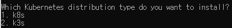

- k8s 설치 진행시 `1` 입력 후 엔터
- k3s 설치 진행시 `2` 입력 후 엔터

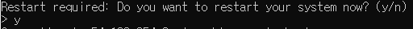

- 재시작을 해야지만 스크립트의 설정이 적용되므로 `y` 입력 후 엔터.

### 2.1_k8s_cluster_initialize.sh(master node)
쿠버네티스 클러스터를 생성하는 스크립트
  - 마스터 노드가 될 노드에 실행(쿠버네티스 클러스터를 생성한 노드가 `control-plane(master node)`이 됨.)

스크립트 실행: `./2.1_k8s_cluster_initialize.sh`

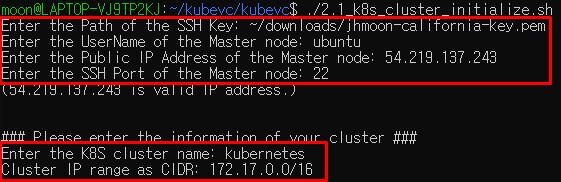

- 순서대로 `ssh key의 경로`, 마스터 노드의 `user name`, `Public IP` ,`SSH Port`를 입력 후 엔터.
- 이후 `cluster name`과 `cluster IP range`(클러스터 내부 통신을 위한 IP 범위) 입력.
    - 입력하지 않고 엔터를 누를 시 `default`로 `kubernetes`, `172.17.0.0/16` 설정.
- `kubectl get node --kubeconfig=$HOME/.kube/kubernetes`로 정상 작동 확인.
    - --kubeconfig= [ config_path ] : 이 옵션은 kubectl 명령어를 사용할 `cluster config`를 지정함.
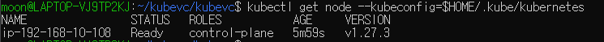

### 2.2_k8s_worker_node_join.sh
쿠버네티스 클러스터에 워커노드를 가입시키는 스크립트

스크립트 실행:  `./2.2_k8s_worker_node_join.sh`


- 순서대로 `ssh key의 경로`, 마스터 노드의 `user name`, `Public IP`, `SSH Port`를 입력 후 엔터.
- 이후 순서대로 워커노드의 `user name`, `Public IP`, `SSH Port`를 입력.
    - 계속해서 워커노드의 정보를 입력하면 입력한 노드 모두 클러스터에 가입 됨.
- 모두 입력했으면 0을 입력해 다음으로 진행.
- `kubectl get node --kubeconfig=$HOME/.kube/kubernetes`로 워커노드 가입 확인.

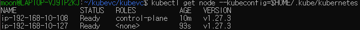

- 워커노드에서 `1_environment_setup_localhost.sh`를 실행하지 않고 `2.2_k8s_worker_node_join.sh`를 실행했을 경우
  - 마스터노드와 워커노드 모두에 접근해 `sudo kubeadm reset`, `y`를 입력해 초기화 한 후 `2.1_k8s_cluster_initialize.sh`부터 재진행.

### 3_deploy_ingress_and_loadbalancer.sh
쿠버네티스 클러스터에 인그레스와 로드밸런서를 배포하는 스크립트

스크립트 실행: `./3_deploy_ingress_and_loadbalancer.sh`

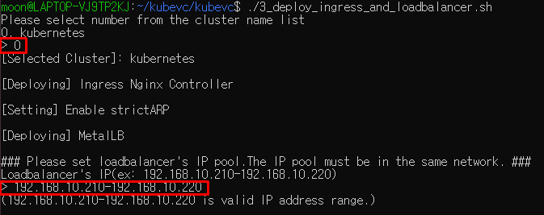

- 인그레스와 로드밸런서(metallb)를 배포할 클러스터 선택(예시에선 `0` 입력) 후 환경에 알맞는 `Loadbalancer의 IP pool`(서비스에 IP를 할당하기 위함)을 입력.

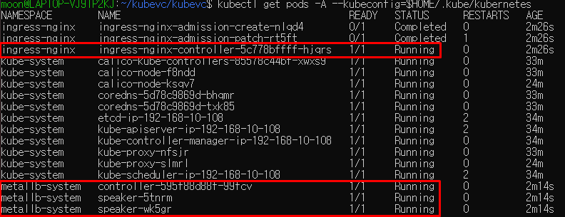

- `kubectl get pods -A --kubeconfig=$HOME/.kube/kubernetes`로 `metallb`와 `ingress-nginx` 정상 작동 확인

### nfs_server_install.sh

NFS 서버를 설치하는 스크립트

스크립트 실행: `./nfs_server_install.sh`

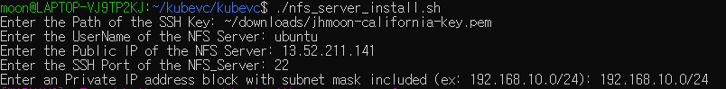

- 순서대로 `ssh key의 경로`, nfs 서버의 `user name`, `Public IP`, `SSH Port`, `CIDR`을 입력 후 엔터.

### nfs_models.dir_mount_k3s.sh

k3s를 사용하는 경우 NFS 서버의 `models` 디렉토리를 워커노드와 마운트하는 스크립트

스크립트 실행: `./nfs_models.dir_mount_k3s.sh`

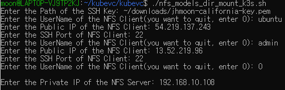

- 순서대로 `ssh key의 경로`, nfs 서버의 `user name`, `Public IP`, `SSH Port`를 입력 후 엔터.
- 이후 nfs 클라이언트(워커노드)의 `user name`, `Public IP`, `ssh port` 입력.
  - 모든 입력이 끝났으면 `0` 입력 후 엔터.

### 4_deploy_model.sh
사용할 모델을 배포하는 스크립트
- 이 스크립트를 실행하기 전 `nfs_server_install.sh`을 먼저 실행해야 함.

1. `cd models` models 디렉토리로 이동
2. `./model_download.sh`를 실행해 모델 다운로드
3. `cd ..` kubevc 디렉토리로 이동
4. 스크립트 실행: `./4_deploy_model.sh` 

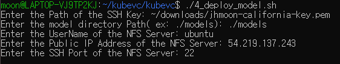

- 순서대로 `ssh key의 경로`, nfs 서버의 `user name`, `Public IP`, `SSH Port`를 입력 후 엔터.
- 이후 nfs 서버에 접속해 `cd /models`, `find .` 입력 후 확인

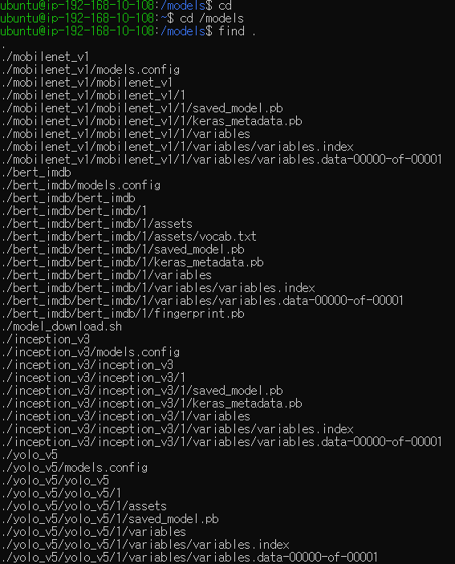

### 4_deploy_tfserving.sh
tfserving을 배포하는 스크립트

스크립트 실행: `./4_deploy_tfserving.sh`

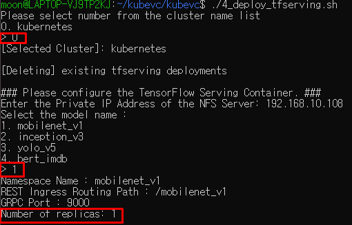

1. 모델을 배포할 클러스터 선택(예시는  `0` 입력)
2. 배포할 모델 선택 (예시에선 `1`을 입력해 `mobilenet_v1` 선택)
3. 배포할 레플리카 수 입력 (예시에선 `1` 입력)
4. `kubectl get pods -A --kubeconfig=$HOME/.kube/kubernetes` 로 정상 작동 확인

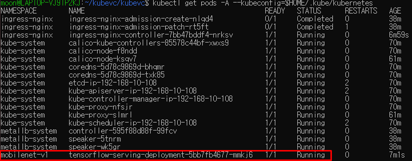

5. 마스터 노드에서 `kubectl get service -A` 입력 후 `LoadBalancer`의 `EXTERNAL-IP` 확인
6. `curl 192.168.10.210/mobilenet_v1/v1/models/mobilenet_v1/metadata`로 `metadata` 접근 확인
   - ex) curl (로드 밸런서의 EXTERNAL-IP)/(model_name)/v1/models/(model_name)/metadata

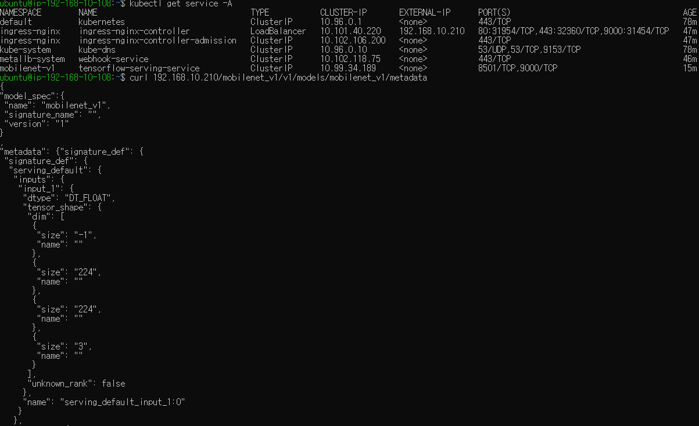

### 5_deploy_monitroing.sh

모니터링을 배포하는 스크립트

스크립트 실행: `./5_deploy_monitroing.sh`

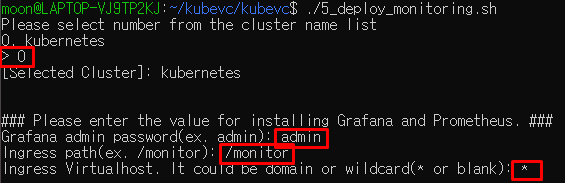

1. 모니터링을 배포할 클러스터 선택 (예시에선 `0` 입력)
2. Grafana admin 계정의 password 입력(예시에선 `admin` 입력)
3. ingress path 입력(예시에선 `/monitor` 입력)
4. ingress virtualhost 입력(예시에선 `*` 입력)
5. `kubectl get pods -A —kubeconfig=$HOME/.kube/kubernetes`로 모니터링 정상 작동 확인

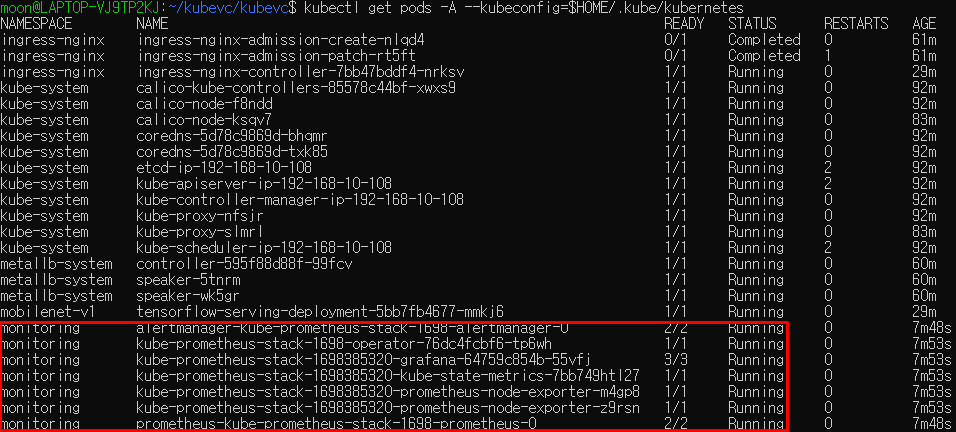