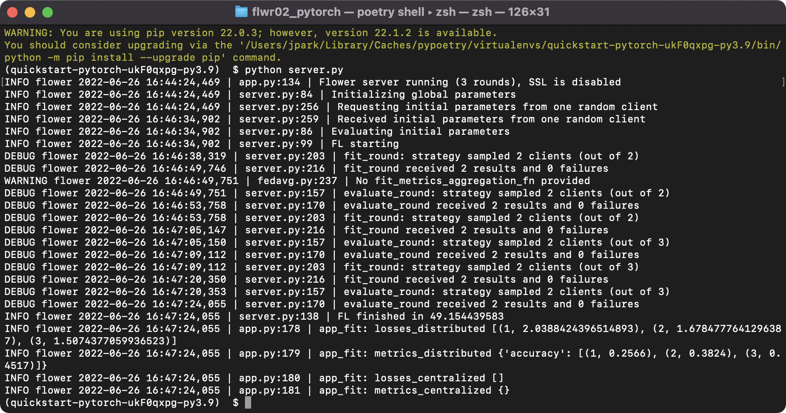
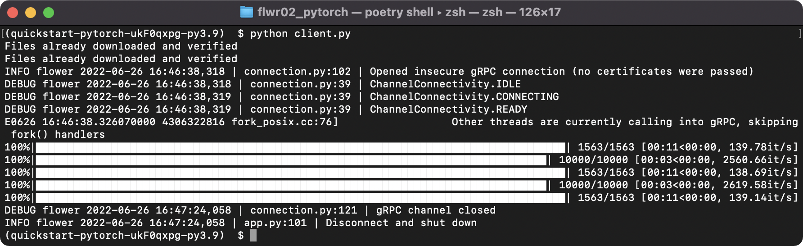
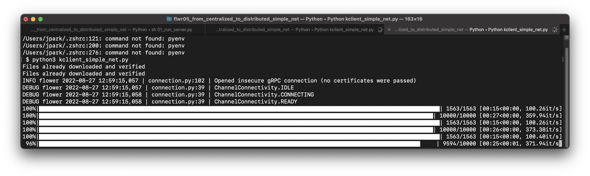

# 실행방법  

- 참고 : https://flower.dev/
- 참고 : https://github.com/adap/flower/tree/main/examples/quickstart_pytorch

## 사전 준비 : 가상환경 관리자 poetry 설치

- poetry 의존성 패키지 설치

```bash
$ poetry install
```


- 자세한 설치 방법은 아래 문서를 참고합니다.

  (1) https://python-poetry.org/docs/


- No module named 'virtualenv.activation.xonsh' 에러 발생시, 기존 virtualenv 삭제합니다.

  . https://stackoverflow.com/questions/71086270/no-module-named-virtualenv-activation-xonsh

```bash
$ pip uninstall virtualenv
```


1. 터미널 열고 poetry shell 실행 및 의존성 패키지 설치

```bash
$ poetry shell
$ pip install flwr
$ pip install torch torchvision
$ pip install tqdm
```

2. 터미널 열고, poetry shell 실행 후 서버 실행 

```bash
$ poetry shell
$ python server.py
```



3. 새로운 터미널 열고, poetry shell 실행 후, 클라이언트 1번 실행 

```bash
$ poetry shell
$ python client.py
```



4. 새로운 터미널 열고, poetry shell 실행 후, 클라이언트 2번 실행 

```bash
$ poetry shell
$ python client.py
```


