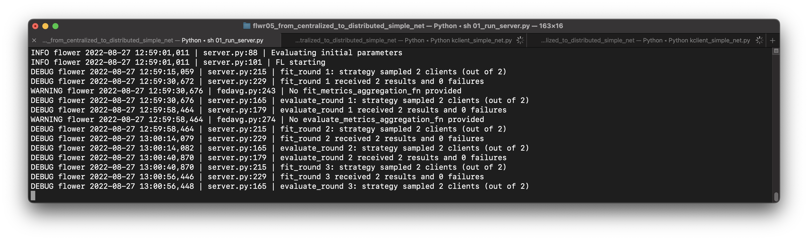
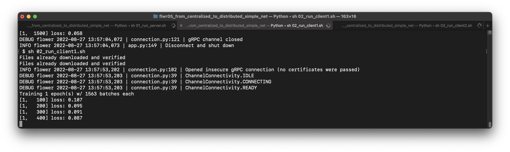
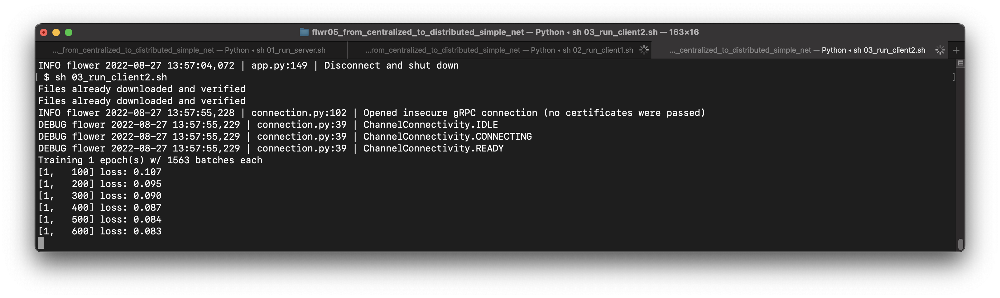
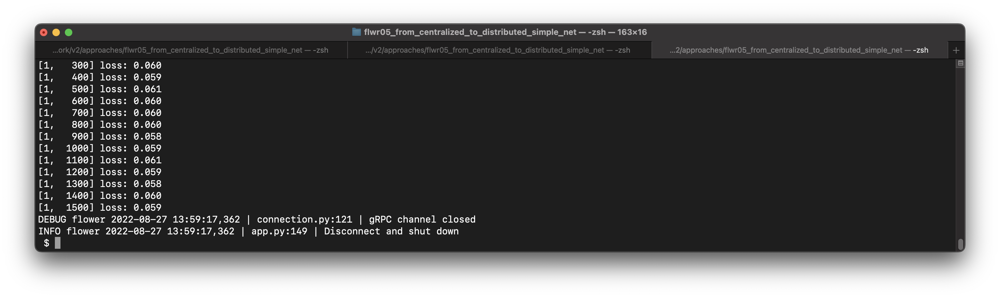
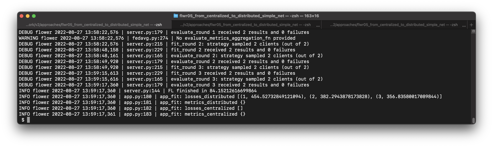

# 연합학습 예제코드

- Cifar10으로 Resnet50을 학습합니다.
- 학습에 상대적으로 오랜 시간이 걸립니다.

## Cifar10 dataset 

- https://www.cs.toronto.edu/~kriz/cifar.html
- classes
```bash
    airplane										
    automobile										
    bird										
    cat										
    deer										
    dog										
    frog										
    horse										
    ship										
    truck
```

## 수행절차

```bash
    # open new terminal and,
    $ sh 01_run_server.sh
    
    # open new terminal and,
    $ sh 02_run_client1.sh

    # open new terminal and,
    $ sh 03_run_client2.sh 
```


## 동작 예시

- 서버 프로세스 실행


- 클라이언트 1 프로세스 실행


- 클라이언트 2 프로세스 실행


- 클라이언트 1 프로세스 완료


- 클라이언트 2 프로세스 완료


- 서버 프로세스 완료
