-----------------------------------------------------
# 기술문서 
 - 기술문서명 : 시스템정합서 1.0(분산학습, 병행추론)
 - 과제명 : 능동적 즉시 대응 및 빠른 학습이 가능한 적응형 경량 엣지 연동분석 기술개발
 - 영문과제명 : Development of Adaptive and Lightweight Edge-Collaborative Analysis Technology for Enabling Proactively Immediate Response and Rapid Learning
 - Acknowledgement : This work was supported by Institute of Information & communications Technology Planning & Evaluation (IITP) grant funded by the Korea government(MSIT) (No. 2021-0-00907, Development of Adaptive and Lightweight Edge-Collaborative Analysis Technology for Enabling Proactively Immediate Response and Rapid Learning).
 - 작성자 : 박종빈, 박효찬, 금승우, 황지수
-----------------------------------------------------

# 개요

- 분산학습 및 병행추론을 위한 클라우드-에지 프레임워크 시스템정합서입니다.


# 분산학습 환경 시스템 정합
---------------------------------------------------------

- 시스템의 핵심구성요소는 제어노드와 분산학습노드(에지노드) 입니다.
- 모델을 관리하는 모델레지스트리(Model Registry)를 포함할 수 있습니다.

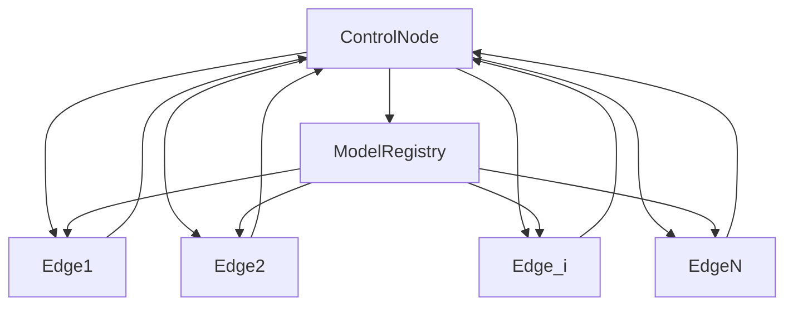


## 분산학습 환경 구축
---------------------------------------------------
- 분산학습 이기종 엣지 기기 연동 및 연합학습 환경을 구축합니다.


### HW 환경 구성
---------------------------------------------------

- 제어노드 : 
  . {MacbookPro14 or Desktop PC}

- 에지노드 디바이스 : 
  . 현재 구성된 디바이스 {RTX3080ti, RPI, TX2 8G}
  . 차년도 계획 디바이스 {NANO 4G, MacMini}


### SW 환경 구성
---------------------------------------------------

#### (1) 제어노드에 Ansible 설치

- 제어노드에서 에지노드 디바이스를 제어, 관리, 모니터링 하기 위한 용도입니다.
- 시각화노드(GUI 서버)와의 연동을 고려한 구조입니다.

```bash
  # pip로 설치하는 방법입니다.
  $ pip install ansible
  
  # or 설치 할 앤서블 버전 설정
  $ pip install ansible==2.10.7

  # or conda로 설치 할 수 있습니다.
  $ conda install ansible

  # or ubuntu에서는 apt-get으로 설치할 수 있습니다.
  $ sudo apt install ansible

  # MacOS에는 brew로 설치할 수 있습니다.
  $ brew install ansible
```

#### (2) 제어노드에서 에지노드에 접속하기 위한 공개키를 생성하고 등록합니다.

- 제어노드에서 에지노드를 제어 및 모니터링 하려면 ssh 채널을 사용합니다.
- 암호 입력과정을 생략하고, 주기적인 모니터링을 위해 다음과 같은 처리를 수행합니다.

   1. 제어노드는 RSA 방식으로 공개키(대칭암호화)를 생성합니다.

   2. 이를 각각의 에지노드 디바이스에 전송하여, ~/.ssh/authorized_keys 파일에 등록합니다.


#### (2-1) 구체적으로 아래와 같은 절차를 따릅니다.

- 단계 1. ssh-keygen으로 RSA 방식의 비밀키, 공개키 쌍을 생성합니다.
- 단계 2. ssh-copy-id로 제어노드에서 생성한 공개키를 에지노드 디바이스로 전송 및 복사합니다.
- [주의] RSA 방식으로 키를 생성하면, 비밀키(개인키)와 공개키가 생성됩니다. 공개키는 말 그대로 공개가 가능하지만, 비밀키(개인키)는 절대 유출되면 안됩니다.


#### (2-2) 공개키 설정 예시

- 네트워크에 2대의 컴퓨터 {A, B}가 있다고 가정합니다.
- A 는 "192.168.1.5" IP를 갖는다고 하고,
- B 는 "192.168.1.3" IP를 갖는다고 가정합니다.
- B 의 사용자 id는 "user"이라고 가정합니다.
- A에서 다음과 같이 ssh-keygen으로 암호화키를 만듭니다.

```bash
$ ssh-keygen -t rsa
```

- private key(비밀키)와 public key(공개키)가 쌍으로 만들어집니다.
- A에서 만든 공개키를 ssh-copy-id 명령어를 사용하여 B로 전송합니다.

```bash
$ ssh-copy-id user@192.168.1.3
```

- A의 공개키 ~/.ssh/id_rsa.pub 의 내용이 B에 전달되어 B의 ~/.ssh/authorized_keys 파일에 추가됩니다.

- 이제 A는 B로 암호 입력 없이 접속 가능합니다. 접속 예시는 아래와 같습니다.

```bash
$ ssh user@192.168.1.3
```


#### (2-3) Ansible 기반 연동 예시 1 (ping)

- 예제 코드를 git 명령어로 다운로드 합니다.

```bash
  $ git clone git@github.com:etri-edgeai/cloud-edge-framework.git
```

- 혹은 git 웹 리포지토리에 접속하여 zip 파일을 다운로드 합니다.

```bash
  https://github.com/etri-edgeai/cloud-edge-framework
```

- 다운로드 폴더에서 아래 경로로 이동합니다.

```bash
  $ cd cloud-edge-framework/v2/vnv/mission1/scripts
```


- 연동할 에지노드 디바이스 정보들을 기술하는 hosts.ini 파일을 확인합니다.
- 신규로 추가되는 장치들을 이 파일에 수동 등록합니다.
- [참고] 향후 GUI 서버와 연계하여 hosts.ini 파일을 수동으로 수정하는 과정을 지양할 것입니다. 여기서는 시험 환경 구축을 위해서 본 파일을 직접 수정합니다.


```bash
  $ cd cloud-edge-framework/v2/vnv/mission1/scripts
  $ cat hosts.ini
```
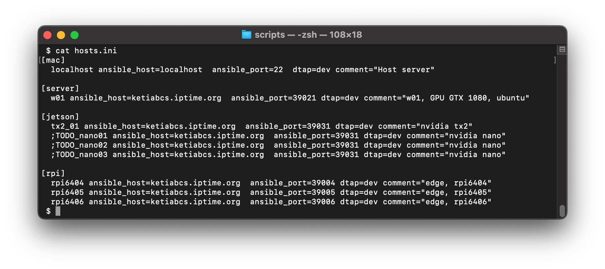


```bash
 $ cat hosts.ini 
[mac]
  localhost ansible_host=localhost  ansible_port=22  dtap=dev comment="Host server"

[server]
  w01 ansible_host=ketiabcs.iptime.org  ansible_port=39021 dtap=dev comment="w01, GPU GTX 1080, ubuntu"

[jetson]
  tx2_01 ansible_host=ketiabcs.iptime.org  ansible_port=39031 dtap=dev comment="nvidia tx2"
  ;TODO_nano01 ansible_host=ketiabcs.iptime.org  ansible_port=39031 dtap=dev comment="nvidia nano"
  ;TODO_nano02 ansible_host=ketiabcs.iptime.org  ansible_port=39031 dtap=dev comment="nvidia nano"
  ;TODO_nano03 ansible_host=ketiabcs.iptime.org  ansible_port=39031 dtap=dev comment="nvidia nano"

[rpi]
  rpi6404 ansible_host=ketiabcs.iptime.org  ansible_port=39004 dtap=dev comment="edge, rpi6404"
  rpi6405 ansible_host=ketiabcs.iptime.org  ansible_port=39005 dtap=dev comment="edge, rpi6405"
  rpi6406 ansible_host=ketiabcs.iptime.org  ansible_port=39006 dtap=dev comment="edge, rpi6406"
```


- 제어노드에서 run_ping.sh 를 실행합니다.

```bash
  $ cd cloud-edge-framework/v2/vnv/mission1/scripts/
  $ run_ping.sh
```

- 아래는 제어노드가 에지노드 디바이스들을 잘 인식하는 일례입니다.
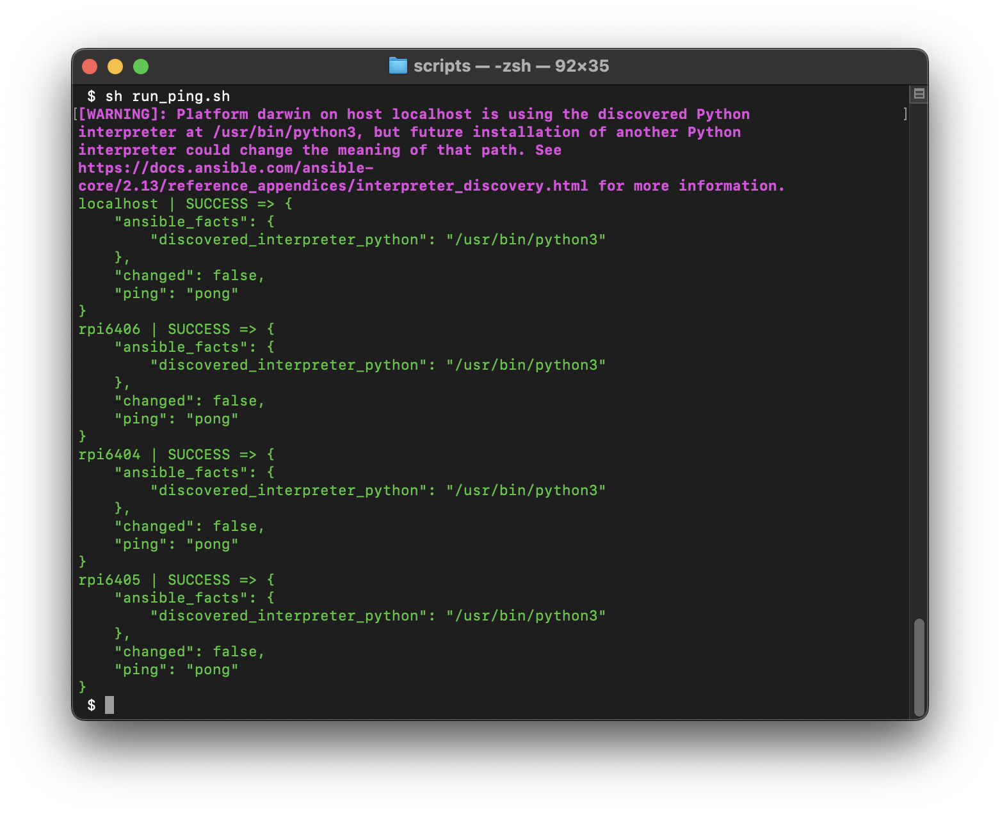

```bash

localhost | SUCCESS => {
    "ansible_facts": {
        "discovered_interpreter_python": "/usr/bin/python3"
    },
    "changed": false,
    "ping": "pong"
}
rpi6404 | SUCCESS => {
    "ansible_facts": {
        "discovered_interpreter_python": "/usr/bin/python3"
    },
    "changed": false,
    "ping": "pong"
}
rpi6405 | SUCCESS => {
    "ansible_facts": {
        "discovered_interpreter_python": "/usr/bin/python3"
    },
    "changed": false,
    "ping": "pong"
}
rpi6406 | SUCCESS => {
    "ansible_facts": {
        "discovered_interpreter_python": "/usr/bin/python3"
    },
    "changed": false,
    "ping": "pong"
}
```

#### (2-4) Ansible 연동 예시 2 (get_temperature)

- 제어노드에서 run_get_temperature.sh 를 실행합니다.

```bash
  $ cd cloud-edge-framework/v2/vnv/mission1/scripts/
  $ run_get_temperature.sh
```

- 아래와 같이 온도값을 읽어 온다면 연동이 잘 되는 것입니다.
- 단, 이 경우는 RPI(라즈베리파이) 에지노드 디바이스에 대해서만 동작합니다. 즉, 에지노드의 구체적인 사양에 따라 구체적인 실행 명령어는 달라집니다.

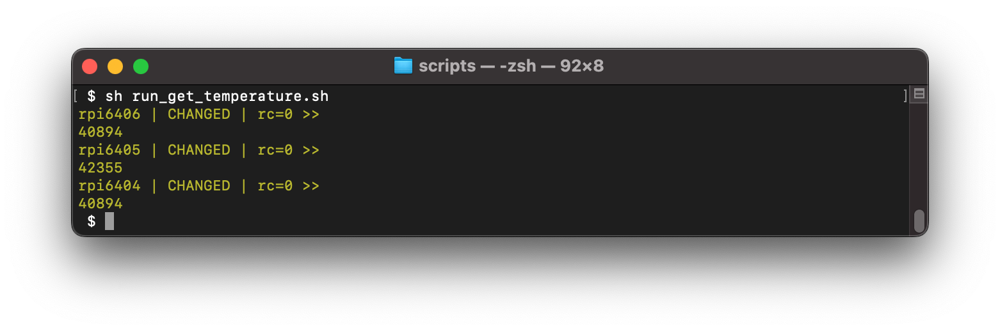

```bash
 $ sh run_get_temperature.sh
rpi6406 | CHANGED | rc=0 >>
40894
rpi6405 | CHANGED | rc=0 >>
42355
rpi6404 | CHANGED | rc=0 >>
40894
```


#### (2-5) Ansible 연동 예시 3 (get_memfree)

- 제어노드에서 run_get_memfree.sh 를 실행합니다.

```bash
  $ cd cloud-edge-framework/v2/vnv/mission1/scripts/
  $ run_get_memfree.sh
```

- 아래와 같이 메모리 정보를 수집합니다.

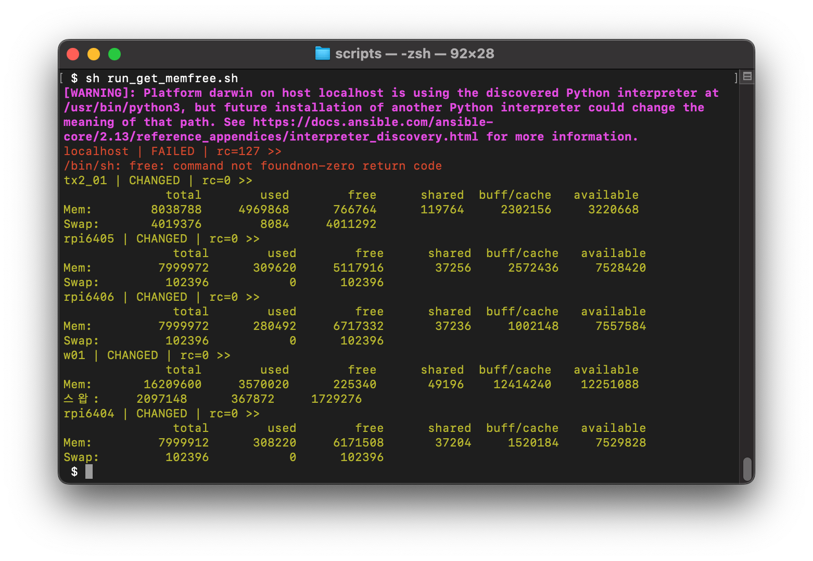

```bash
 $ sh run_get_memfree.sh 
[WARNING]: Platform darwin on host localhost is using the discovered Python interpreter at
/usr/bin/python3, but future installation of another Python interpreter could change the
meaning of that path. See https://docs.ansible.com/ansible-
core/2.13/reference_appendices/interpreter_discovery.html for more information.
localhost | FAILED | rc=127 >>
/bin/sh: free: command not foundnon-zero return code
tx2_01 | CHANGED | rc=0 >>
              total        used        free      shared  buff/cache   available
Mem:        8038788     4969868      766764      119764     2302156     3220668
Swap:       4019376        8084     4011292
rpi6405 | CHANGED | rc=0 >>
               total        used        free      shared  buff/cache   available
Mem:         7999972      309620     5117916       37256     2572436     7528420
Swap:         102396           0      102396
rpi6406 | CHANGED | rc=0 >>
               total        used        free      shared  buff/cache   available
Mem:         7999972      280492     6717332       37236     1002148     7557584
Swap:         102396           0      102396
w01 | CHANGED | rc=0 >>
              total        used        free      shared  buff/cache   available
Mem:       16209600     3570020      225340       49196    12414240    12251088
스왑:     2097148      367872     1729276
rpi6404 | CHANGED | rc=0 >>
               total        used        free      shared  buff/cache   available
Mem:         7999912      308220     6171508       37204     1520184     7529828
Swap:         102396           0      102396

```


## 구성환경 데이터베이스(CMDB) 구축 
---------------------------------------------------------

- 제어노드는 구성관리 데이터베이스 (Configuration Management DataBase, CMDB) 환경을 갖춥니다.
- CMDB를 통해 네트워크 상에 분산된 학습노드(에지노드)를 관리할 수 있습니다.
- 참고 : https://ansible-cmdb.readthedocs.io/en/latest/usage/


### Mac에서 설치

- 본 정합환경에서는 제어노드를 MacOS 운영체제가 설치된 컴퓨터를 사용합니다.

```bash
$ brew install ansible-cmdb
```

### 결과

- 그림과 같이 제어노드는 분산 학습노드(에지노드)들의 구성정보를 요약 확인할 수 있습니다.
[demo](demo/overview.html)


### 구성환경 정보 수집을 위한 명령어 요약

```bash
$ mkdir tmp

$ ansible -i hosts.ini all -m setup --tree tmp/

$ ansible-cmdb tmp/ > tmp/overview.html    

$ open tmp/overview.html
```


### 구성환경 정보 수집을 위한 세부 절차

#### (단계 1) 정보 수집

```bash
$ mkdir tmp.0
$ mkdir tmp.1

$ ansible -i hosts.ini all -m setup --tree tmp.0/
```


#### (단계 2 - 1) HTML 파일 생성

```bash
$ ansible-cmdb -t html_fancy tmp.0/ > tmp.1/overview.html    

$ open tmp.1/overview.html
```

- HTML 출력 예시입니다.
- 라즈베리파이 컴퓨터 3대의 정보 {rpi01, rpi02, rpi03} 를 원격에서 수집합니다.
- {rpi01} 은 Arm 64비트 Linux OS가 설치 되었습니다.
- {rpi02}는 네트워크와 연결이 안된 상태입니다.
- {rpi03} 은 Arm 32비트 Linux OS가 설치 되었습니다.


#### (단계 2 - 2) CSV 파일 생성

```bash
$ ansible-cmdb -t csv tmp.0/ > tmp.1/overview.csv    

$ open tmp.1/overview.csv
```

#### (단계 2 - 3) JSON 파일 생성

```bash
$ ansible-cmdb -t json tmp.0/ > tmp.1/overview.json    

$ open tmp.1/overview.json
```


#### (단계 2 - 4) Markdown 파일 생성

```bash
$ ansible-cmdb -t markdown tmp.0/ > tmp.1/overview.md    

$ open tmp.1/overview.md
```


#### (단계 2 - 5) SQL 파일 생성

```bash
$ ansible-cmdb -t sql tmp.0/ > tmp.1/overview.sql    

$ open tmp.1/overview.sql
```


### 고급 옵션

#### 컬럼 필터링

- 특정 컬럼 정보만 선택하여 추출 가능
```bash
$ ansible-cmdb -t txt_table --columns name,os,ip,mem,cpus tmp.0/  > tmp.1/overview.txt

$ open tmp.1/overview.txt
```

- 특정 컬럼 정보만 빼고 추출 가능
```bash
$ ansible-cmdb -t html_fancy \
             --exclude-cols comment,groups,mem_usage,arch,swap_usage,disk_usage,physdisk_size \
             -i hosts.ini \
             tmp.0/ > tmp.1/overview.html

$ open tmp.1/overview.html
```


## Flower 기반 분산연합학습 수행
---------------------------------------------------------

- 본 정합 프레임워크에서는 Flower를 분산연합학습을 위한 백엔드 기술로 사용합니다.

1. 설치 

```bash
$ pip install flwr
```

2. 터미널 열고,  서버 실행 

```bash
$ python server.py
```

3. 새로운 터미널 열고, 클라이언트 1번 실행 

```bash
$ python client.py
```

4. 새로운 터미널 열고, 클라이언트 2번 실행 

```bash
$ python client.py
```

### Cifar10 dataset 

- Cifar10으로 Resnet50을 학습
- 데이터셋 참고 : https://www.cs.toronto.edu/~kriz/cifar.html
- classes
```bash
    airplane										
    automobile										
    bird										
    cat										
    deer										
    dog										
    frog										
    horse										
    ship										
    truck
```


#### 수행절차

```bash
    # open new terminal and,
    $ sh 01_run_server.sh
    
    # open new terminal and,
    $ sh 02_run_client1.sh

    # open new terminal and,
    $ sh 03_run_client2.sh 
```


#### 동작 결과

- 서버 프로세스 실행
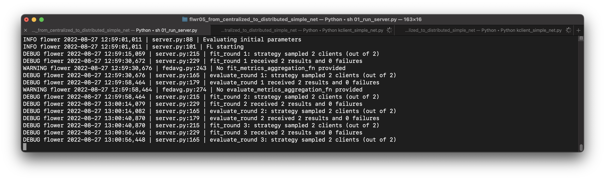

- 클라이언트 1 프로세스 실행
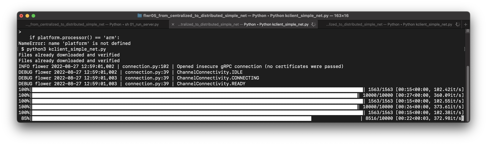

- 클라이언트 2 프로세스 실행
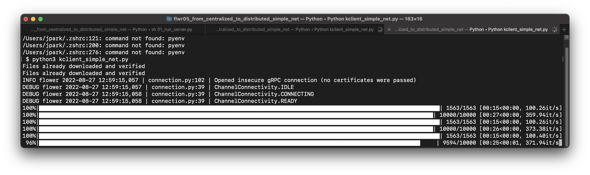

- 클라이언트 1 프로세스 완료
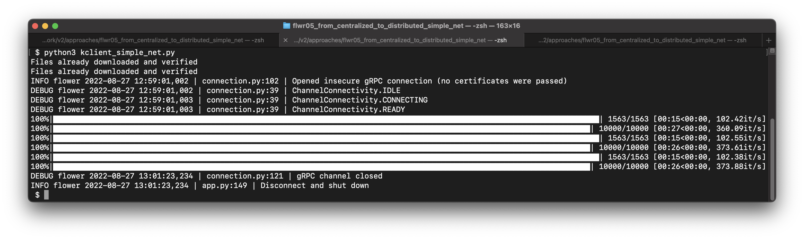

- 클라이언트 2 프로세스 완료
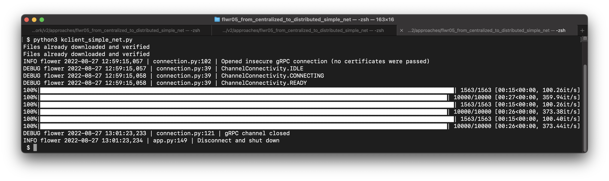

- 서버 프로세스 완료
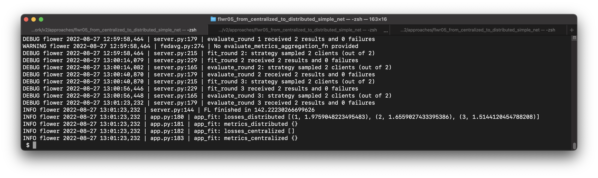


# 병행추론 환경 시스템 정합
---------------------------------------------------------

## 모델 레지스트리 구축

- AI 추론 모델을 서버로부터 각 노드에 배포하기 위한 모델 레지스트리를 구축합니다.

### Docker Registry
- 도커 레지스트리 서버 컨테이너를 빌드한 후 배포하고자 하는 이미지를 레포지토리로 생성합니다.<br>
- 각 노드의 도커를 통해 해당 레지스트리에 접근해 이미지를 받아오고, 또 올릴 수 있습니다.

#### image
```bash
## 배포하고자 하는 컨테이너를 이미지화 합니다.
# commit : 컨테이너의 수정 사항 및 현 구성 그대로 이미지를 생성
docker commit -a "bhc" -m "commit new env" egde_infer edge_model:v1.0

# >> dockerfile.tar 생성됨
```

#### registry container

##### build
```bash
## docker hub에서 registry image를 먼저 다운로드 받으세요.
docker run -d -p 5000:5000 --restart always --name registry registry:2
```

##### push
```bash
## registry 배포용 이미지 생성
# 이름 앞에 레지스트리 url:port를 붙여주시면 됩니다.
docker tag edge_model:v1.0 localhost:5000/edge_model:v1.0

## push
docker push localhost:5000/edge_model:v1.0

## check image list
curl -X GET http://localhost:5000/v2/_catalog
>> {"repositories" : ["centos_test", "edge_model"]}

## check tags list in a repo
curl -X GET http://localhost:5000/v2/$repo_name/tags/list
>> {"name" : "edge_model", "tags" : ["v1.0"]}
```

##### pull
```bash
## pull image from registry
docker image pull localhost:5000/edge_model:v1.0

## build container
docker run -it localhost:5000/edge_model:v1.0
```


#### Registry-WEB
- 기본적인 레지스트리 컨테이너는 시각화를 지원하지 않기 때문에 curl 명령 등을 통해 탐색해야 하는 불편함이 있습니다.<br>
- 레지스트리 컨테이너와 링크되어 작동하는 레지스트리 GUI 웹 컨테이너를 사용하여 시각화를 개선합니다.

##### hyper
```bash
## 개인이 레지스트리 시각화를 위해 구현한 도커이미지입니다.

## pull image
docker pull hyper/docker-registry-web

## build container
# 포트번호 바꾸면 작동 안함
docker run -it -p 8080:8080 --name registry-web \
--link loc-model-reg \
-e REGISTRY_URL=http://loc-model-reg:5000/v2 \
-e REGISTRY_NAME=localhost:5000 hyper/docker-registry-web
```

### Distribution

- 도커를 활용하여 다양한 방식으로 모델을 배포할 수 있습니다.
- 작업 내용들을 바탕으로 모델 배포 파이프라인의 예상도를 도식화합니다.


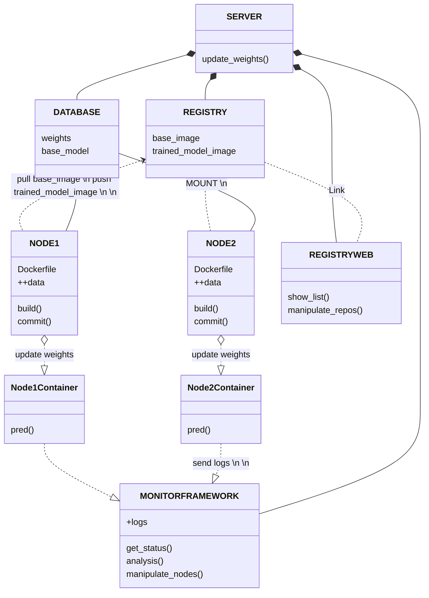


## 예측 테스트 모델 제작

### Image Classification Pre-Trained Models
```bash
## how to start
$ python classifier.py
```
- Pytorch Hub의 ResNet, EfficientNet, MobileNet을 사용했습니다.
- CIFAR10 Dataset으로 학습되었습니다.
  - 10개의 클래스를 예측할 수 있습니다.
    - classes : plane, car, bird, cat, deer, dog, frog, horse, ship, truck
- device CPU만 동작합니다.

### structures
#### classifier.py
- 데이터 전처리를 수행합니다.
- 예측 수행 및 결과 출력을 수행합니다.
- ArgumentParser를 선언하여 인자를 전달 받습니다.

#### load_model.py
- Pytorch Hub로부터 base-model을 수신합니다.
- base-model에 학습된 가중치를 적용합니다.
- model의 output-layer를 data에 맞게 수정합니다.

#### requirements.txt
``` pip install -r requirements.txt ```
- 모델 동작을 위한 package 목록입니다.
  
#### data
- 예측 수행 테스트를 위한 이미지 파일
- 해당 디렉터리 하위에 원하는 데이터를 삽입하여 예측을 테스트할 수 있습니다.
  - ```--input {file_name}```

### args
ArgumentParser를 사용해 원하는 모델과 데이터를 명시할 수 있습니다.
```bash
--help
```
>모델에 대한 기본 정보, 사용한 가능한 모델 목록, 전달 가능한 인자를 출력합니다.
<br>

```bash
--model_type
```
>모델의 종류를 지정합니다.
>- resnet
>- efficientnet
>- mobilenet

<br>

```bash
--model_name
```
>정확한 모델명을 지정합니다. ( --help 에서 출력되는 model-list 참조 )

<br>

```bash
--input
```
>Inferencing을 수행할 데이터를 지정합니다.

<br>


## AI 모델을 도커 이미지로 빌드하기
**모델이 동작할 컨테이너 가상 환경 구축**

### Build Docker Container
```bash
## Base-image from Docker hub
$ docker pull python:3.8

$ docker images
$ docker run -it python:3.8 bash

## send model from host to container
$ docker cp {model_dir} {container_id}:{dir}
```

### Packages
```bash
pip install -r requirements.txt
```
Pytorch의 경우 해당 환경에 맞는 명령을 통해 별도 설치합니다.
```bash
pip3 install torch torchvision torchaudio --extra-index-url https://download.pytorch.org/whl/cpu
```
>Pytorch Installation 참조 : https://pytorch.org/get-started/locally/

### 기타 조작
```bash
## 이미 빌드된 컨테이너 시작
$ docker start {container_name}
## 실행 중인 컨테이너에 쉘 연결
$ docker attach {container_name}
## 재실행
$ docker restart {container_name}
## 이름 변경
docker rename {old_name} {new_name}
```


## 모델 자동 배포 기술

- 각 노드가 모델을 구축하고 명령을 수행하는 과정을 간소화, 자동화합니다.<br>
- 그 외 작업의 편의성을 확보하기 위한 모든 기술과 방법론을 포함합니다.

### ref. pipeline 예상도
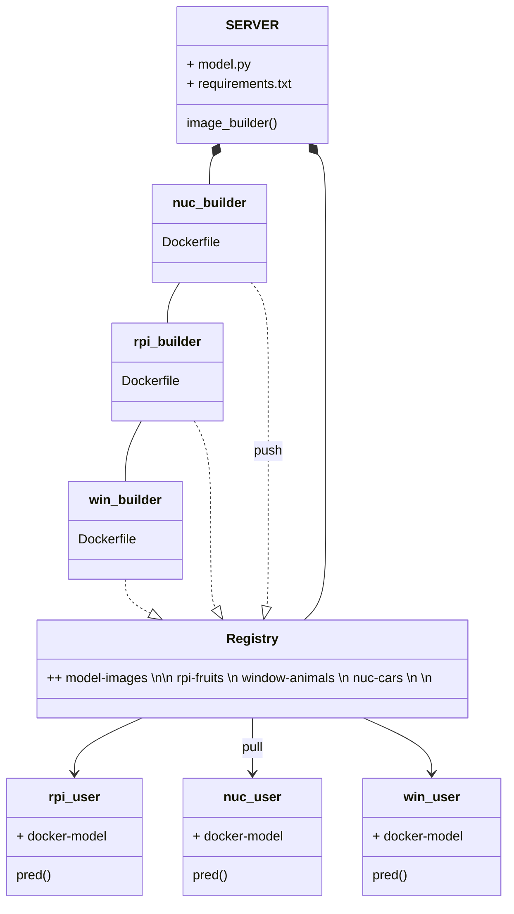

### 1. shell script
```$ sh run-model.sh```<br>
<br>
레지스트리 서버로부터 이미지를 다운로드 받고 컨테이너를 빌드하고 모델 코드를 실행하는 과정을 작성한 스크립트입니다.<br>

  **※ 정상 작동을 위해 모델 코드의 path 단을 수정해야 합니다.**
  ```python
    ## load_model.py
    weights_dir = './home/best_model'
    
    ## classifier.py
    data_path = './home/data/'
  ```
#### 수행 절차
- 레지스트리 서버로부터 이미지 풀(pull)
  - ```$ docker image pull```
- 다운로드한 이미지로 컨테이너 생성
  - ```$ docker run```
- 컨테이너의 커널을 통한 작업 명령 수행
  - ```$ docker exec```
#### 정상 작동 확인 11/02
로컬 환경에서 실험되었습니다.<br>
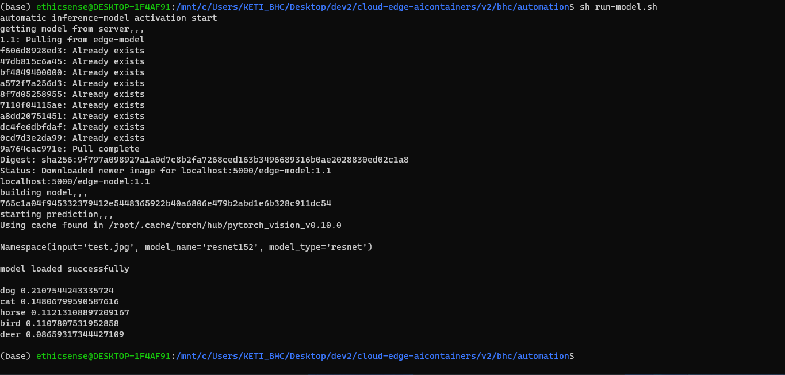

### 2. run.py
```python run.py```<br>
<br>
목적 노드의 OS, CPU Architecture 등 환경 요소를 파악하고 적절한 스크립트를 선택적으로 제작해 배급합니다.<br>
ip, model, input 등 인자를 전달 받아 수행 절차를 구체화하는 과정을 포함합니다.<br>
<br>
### 구성
- 노드 os 및 cpu architecture 탐지
- 입력 받기
 - model config
 - data config
- 스크립트 생성 및 전달
- 결과 출력

#### 실행 결과

##### pc node (windows 10 -> wsl2(linux x86_64), intel amd64)
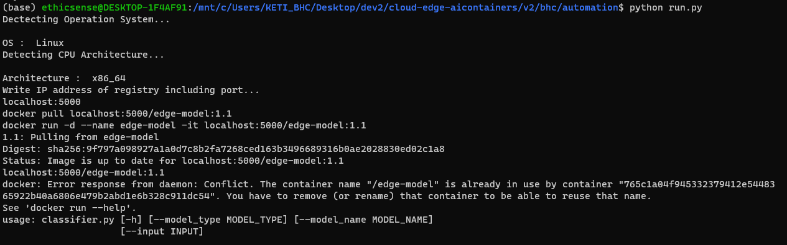
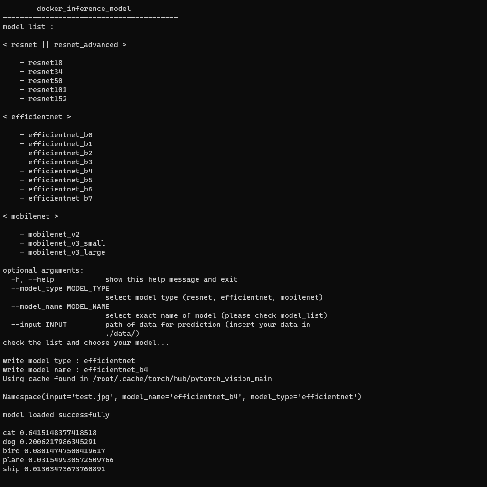

##### rpi node (debian linux, arrch64/v8)
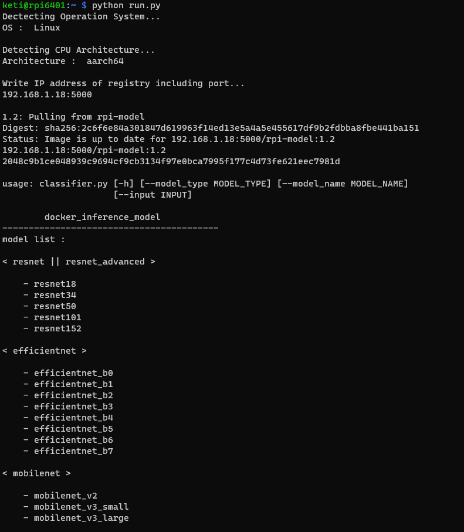


##### 코드 실행 후 docker image | container list
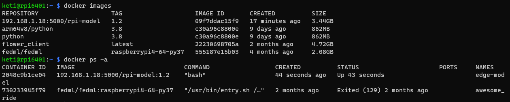


## 그래픽 사용자 인터페이스 모듈의 세부 구성요소
**사용자 인터페이스를 통한 배포, 등록 결과 조회, 목록 확인 기능을 담당**<br>

- GUI를 사용하여 모델을 배포하고 등록 결과를 확인할 수 있습니다. 
- 등록된 모델을 조회할 수 있습니다.

### 조회 정보 | 수행 명령
> 실제 코드와 명령어는 달라질 수 있습니다.<br>

- registry list
  - curl
- model existance verification
  - curl | grep
  - return boolean
- model build | distribution
  - if True : pull
  - if False : build && push && pull
- test model prediction
  - run
  - pred()

### PyQt5
- PyQt5는 GUI programming을 지원하는 python 라이브러리입니다.<br>

### VcXsrv
- Linux 환경의 경우(WSL 포함) GUI Display를 기본적으로 연결해주지 않기 때문에 GUI를 지원하는 가상 서버 어플리케이션을 설치합니다.<br>
<br>
> **install VcXsrv**<br>
> https://sourceforge.net/projects/vcxsrv/

installation 수행 후
```bash
$ export DISPLAY=$(cat /etc/resolv.conf | grep nameserver | awk '{print $2}'):0

## VcXsrv 재실행 ( window 환경에서 ) ( 실행 시 additional parameter "-ac" 확인 )

## wsl 재실행 ( powershell에서 )
$ wsl --list --verbose
$ wsl --shutdown Ubuntu-20.04

## test VcXsrv
$ xeyes
```

### Qt Designer
**PyQt GUI 레이아웃 편집기**<br>
.ui 포맷(XML 문서)으로 저장하여 불러와 사용하거나 .py 포맷으로 변환하여 사용할 수 있습니다.<br>
```bash
## python 파일로 변환
python -m PyQt5.uic.pyuic -x test.ui -o test.py
```

### test
- PyQt5를 사용하여 신규 기능 추가를 위한 코드입니다.
- 클래스 구조와 기능 구현에 필요한 내용 이해에 도움을 줍니다.<br>

### main.py
- demonstration application의 메인 화면으로 사용될 예정인 GUI 레이아웃입니다.<br>

#### 초기화면 구축

##### 레이아웃
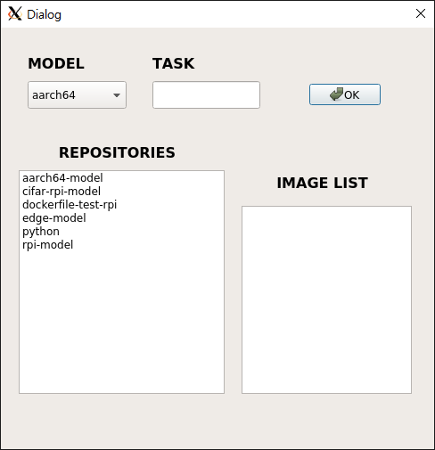

##### 기능 구현
- **레지스트리 등록된 모델 정보 수신**<br>
  레지스트리에 등록된 모델 정보를 불러옵니다.<br>
  repository 정보를 받고 repository 당 등록된 이미지 종류를 오른쪽 리스트뷰에 송출합니다.
- **모델 존재 여부 검증 기능**<br>
  CPU 구조 종류와 수행 태스크를 입력하여 전달하면 모델 존재 여부를 검증하고 다음 수행 절차를 유도합니다.

> 지속 고도화 작업 중에 있으며 레이아웃 및 화면 구성은 변경될 수 있습니다.


### ui2py.py

```bash
$ python -m PyQt5.uic.pyuic -x {name.ui} -o {name.py}
```

- Qt designer로 작성된 .ui 파일을 python 포맷으로 변환하는 작업을 테스트한 코드입니다.<br>
레이아웃 수정 및 기능 고도화 등 작업이 오히려 번거로워져 실제 사용에는 어려움이 있습니다.<br>
전체 레이아웃 구성을 Qt designer로 구현하여 작업할 경우 코드를 간소화할 수 있는 이점이 있습니다.


## 주요 참고문헌

```bibtex
@article{mathur2021device,
  title={On-device federated learning with flower},
  author={Mathur, Akhil and Beutel, Daniel J and de Gusmao, Pedro Porto Buarque and Fernandez-Marques, Javier and Topal, Taner and Qiu, Xinchi and Parcollet, Titouan and Gao, Yan and Lane, Nicholas D},
  journal={arXiv preprint arXiv:2104.03042},
  year={2021}
}
```

