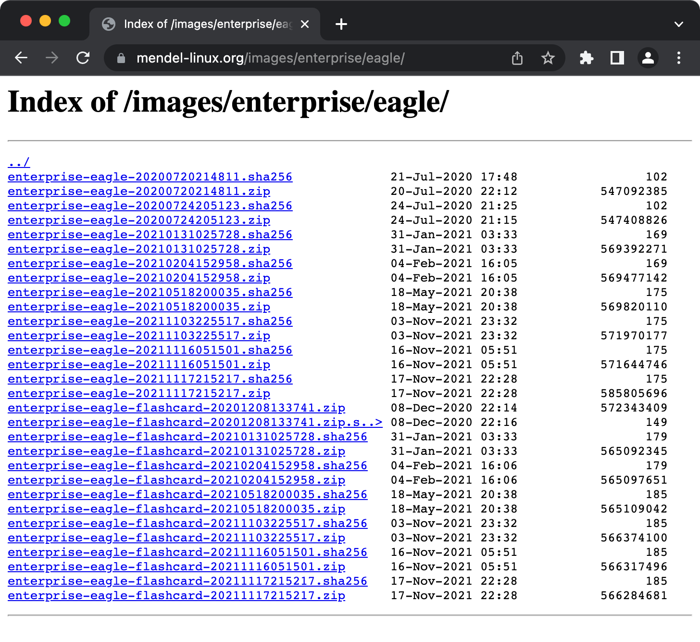
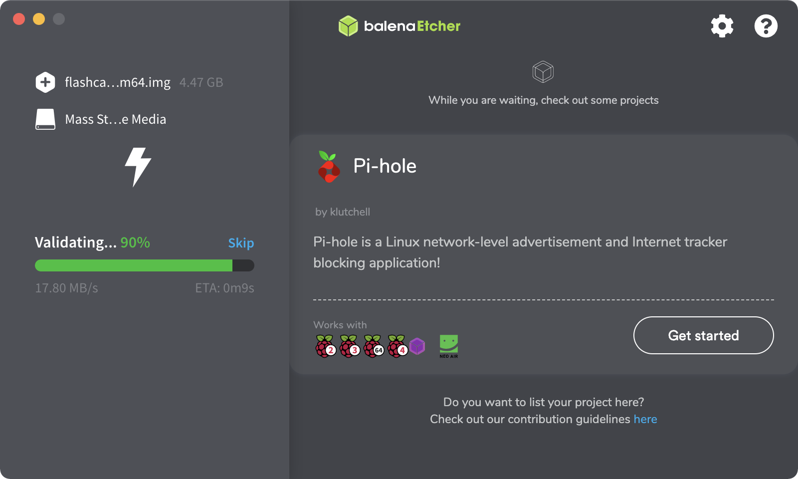

# Coral Dev Board

- 구글이 만든 머신러닝 특화형 미니 개발 보드입니다.
- 자세한 설치 과정은 아래 링크를 참고할 수 있습니다.

## 설치과정 및 사용법 링크

- Coral Dev Board 시작하기
```bash
https://coral.ai/docs/dev-board/get-started#requirements
```

- OS 이미지(Mendel Linux) 선택하여 다운로드 받기

```bash
https://mendel-linux.org/images/enterprise/eagle/
```



혹은 아래와 같이 wget으로 다운로드 받기
 
```bash
$ wget enterprise-eagle-flashcard-20211117215217.zip
```

- OS 이미지를 플래시 메모리에 업데이트하기

맥에서는 Etcher 도구 사용가능

```bash
https://coral.ai/docs/dev-board/reflash/#update-your-board-with-apt-get
```




- 전원 연결하지 않고, 스위치를 ON/OFF/ON/ON 으로 설정하기 --> 설치 모드


- OS 이미지가 탑재된 플래시 메모리를 코랄 보드에 꼽기


- "PWR"라고 표시된 USB-C 타입 커넥터에 전원 연결하고, 보드에 red LED 가 켜지는지 확인

- 5~10분이 지나면 red LED가 꺼지고 설치 완료

- red LED가 꺼졌을 때, 전원연결을 해제하고, microSD card를 제거

- 전원 연결하지 않고, 스위치를 ON/OFF/OFF/OFF 으로 설정하기 --> 부팅 모드

- "PWR"라고 표시된 USB-C 타입 커넥터에 전원 연결하고 부팅 (Mendel Linux 기동)


- 부팅 완료되면 {MDT 설치, 인터넷 연결, 소프트웨어 업데이트} 등을 위해 아래 링크 참고하여 진행합니다.

```bash
 https://coral.ai/docs/dev-board/get-started#connect-internet
```


