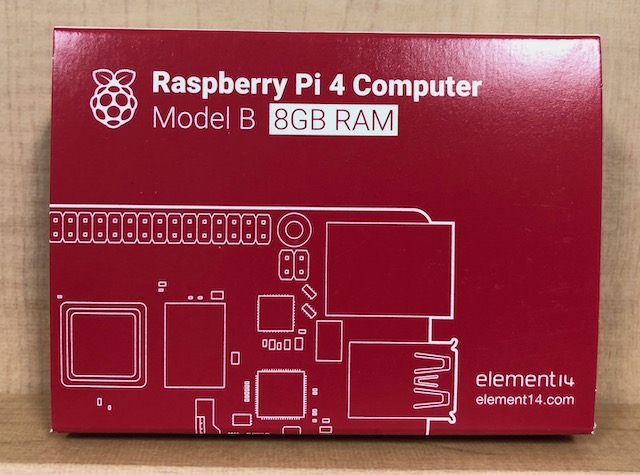
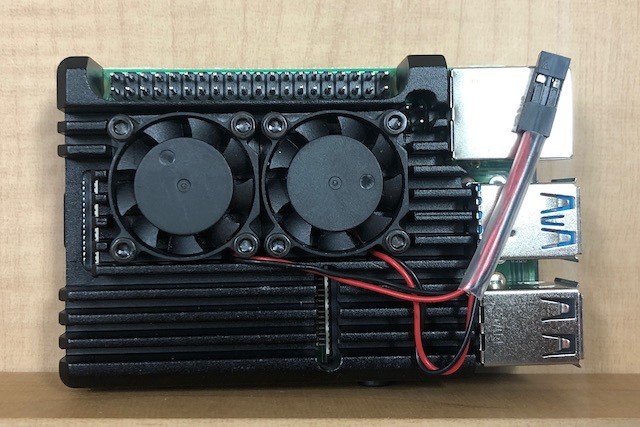
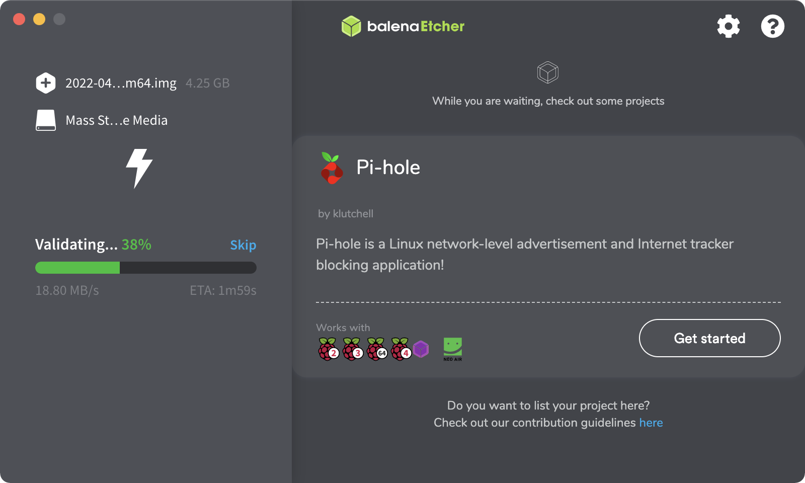

# 라즈베리파이4B 에지 디바이스

## 하드웨어 사양

- 에지 디바이스 명 : Raspberry PI4 model-B, 8GBytes 
- 64bit quad-core Cortex-A72 processor
- 8GB LPDDR4 RAM
- 2 micro HDMI ports (supports up to 4Kp60)
- 2 USB 3.0 ports
- 2 USB 2.0 ports
- Gigabit Ethernet port (유선)
- 802.11b/g/n/ac wireless (무선)
- Bluetooth 5.0
- PoE-capable (requires PoE Hat, sold separately)
- 5V/3A USB-C power supply required (sold separately)

### 주의사항

- 5V USB Type-c 케이블 연결로 전력을 공급받습니다. 
- 이때 3A 전류 제공이 가능한 Power Adaptor 를 써야 합니다.

## 가능한 운영체제

- 기본적으로 리눅스 계열의 운영체제를 설치할 수 있습니다.

- 아래 웹주소를 방문하여 설치 가능한 운영체제를 확인합니다.

```bash
https://www.raspberrypi.com/software/
```

- 운영체제별로 기계학습을 위한 패키지 설치방법이 다르므로, 이는 별도의 문서로 정리합니다.

## 에지 동작 환경 구축

### 하드웨어 준비

- 라즈베리파이4 model-B, 8Gbytes 모델을 준비합니다.
- 라즈베리파이4는 CPU 및 GPU의 발열이 심하므로, 방열 대책을 적용합니다.
- 운영체제 탑재를 위한 32Gbytes 이상의 micro sd card를 준비합니다.






### 운영체제 이미지 탑재

- 서비스 환경에 맞는 라즈베리파이 운영체제 이미지를 다운로드 합니다. 

```bash
https://www.raspberrypi.com/software/
```

- [주의사항] tensorflow 를 설치하려면 64비트 운영체제가 필요할 수 있습니다.

- 다운로드한 라즈베리파이 운영체제를 준비한 micro sd card에 기록합니다.




### 설치후 버전 확인 

```bash
    $ lsb_release -a
```

```bash
No LSB modules are available.
Distributor ID:	Raspbian
Description:	Raspbian GNU/Linux 11 (bullseye)
Release:	11
Codename:	bullseye
```

### Install "sshd"

터미널에서 아래의 명령어를 실행합니다.

```bash
$ sudo systemctl enable ssh
$ sudo systemctl start ssh
```

### IP 정보 확인

- IP 정보를 확인하여 내부/외부에서 접속합니다.

```bash
$ ifconfig | grep 192
```

### SuperUser 권한을 가진 사용자 계정 만들기

- 생성 

```bash
    $ sudo adduser newuser
    $ sudo usermod -aG sudo newuser
```

- 확인

```bash
    $ su - newuser
```

### 한글 설정

- 설치 시 한글을 설정하면 자동으로 패키지가 설치되기도 하지만, 한글이 깨져서 표현되는 경우가 있습니다.
- 아래와 같이 fcitx를 폰트 관리자로 설정하면 대부분 문제가 해결됩니다.

```bash
$ sudo apt-get update
$ sudo apt-get upgrade
$ sudo apt-get install fcitx -y
$ sudo apt-get install fcitx-hangul -y
$ sudo apt-get install fonts-nanum

$ sudo vi /etc/default/im-config
IM_CONFIG_DEFAULT_MODE=fcitx
```

### ssh terminal에서 한글이 깨지는 경우

- GUI에서 Category / Window / Translation : Received data 메뉴 이동합니다.
- 인코딩을 'UTF-8'로 설정합니다.


### SSH 연결 시 멈춤현상

- 원인에 대한 설명은 아래와 같습니다.

```bash
https://discourse.osmc.tv/t/solved-ssh-connection-sometimes-hangs/76504/5


IPQoS cs0 cs0

Edit: explaination of the problem:
OpenSSH sets the TOS (type Of Service) field in the IP datagram as “lowdelay” for interactive sessions and “throughput” for non-interactive sessions. My router doesn’t handle properly those settings, so I changed them in Cs0, Cs0 (aka 0x00, 0x00) <==> (best effort, best effort) and solved the instability/freeze SSH issues.
```

- 처리 방법 

파일 열기 

```bash
    $ vi /etc/ssh/sshd_config
```

아래 내용 추가

```bash
      IPQoS cs0 cs0
```
