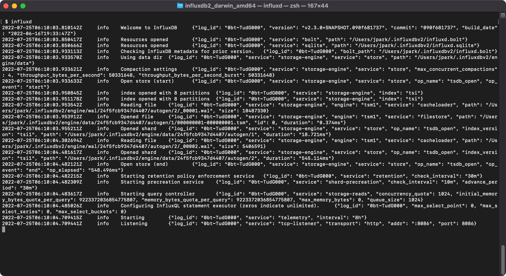
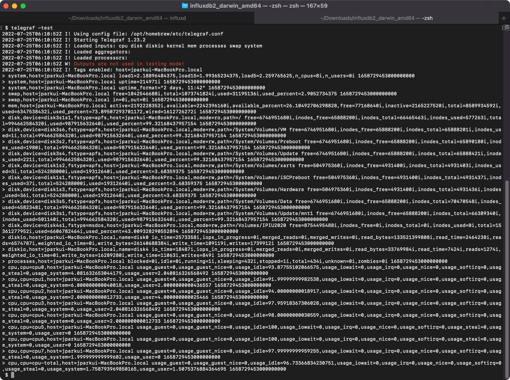

# influxdb

## 1차 테스트
- [-] 2.x 버전 사용시 인증 과정이 매끄럽지 않음
- [-] 아직 개발중이고, 문서화된 자료도 매우 불편함
- [-] 하위 호환성을 고려하지 않는점도 큰 단점임
- [-] 문법이 종래의 sql과 다름, 시계열 처리에만 특화된 측면이 있음
- [-] CSV로딩을 해보면 많이 불편하다. pandas를 기대하면 안된다.
- [+] UI와 연동되는 점, 시계열 데이터 처리에 특화된 부분에 대해서는 매우 좋음
- [+] 일단 사용법에 익숙해지면 telegraf와 연계하여 모니터링 처리를 강력하게 할 수 있을 것으로 기대됨 

## 한줄의견
- 아름다운 외모, 성숙하고 있는 내면


##

- Docker 기반 설치 및 실행

```bash
    $ docker run -d --name=influxdb_edgeai -it -p 8086:8086 -p 8083:8083 -e INFLUXDB_ADMIN_ENABLED=true -v influxdb:/var/lib/influxdb influxdb

    $ docker run -p 8086:8086 \
      -v influxdb:/var/lib/influxdb \
      -v influxdb2:/var/lib/influxdb2 \
      -v $PWD/influxdb.conf:/etc/influxdb/influxdb.conf \
      -e DOCKER_INFLUXDB_INIT_MODE=upgrade \
      -e DOCKER_INFLUXDB_INIT_USERNAME=jpark \
      -e DOCKER_INFLUXDB_INIT_PASSWORD=adminadmin\
      -e DOCKER_INFLUXDB_INIT_ORG=my-org \
      -e DOCKER_INFLUXDB_INIT_BUCKET=my-bucket \
      influxdb:2.0

    $ docker run -p 8086:8086 -v influxdb:/var/lib/influxdb -v influxdb2:/var/lib/influxdb2 -v $PWD/influxdb.conf:/etc/influxdb/influxdb.conf -e DOCKER_INFLUXDB_INIT_MODE=upgrade -e DOCKER_INFLUXDB_INIT_USERNAME=jpark -e DOCKER_INFLUXDB_INIT_PASSWORD=adminadmin -e DOCKER_INFLUXDB_INIT_ORG=my-org -e DOCKER_INFLUXDB_INIT_BUCKET=my-bucket influxdb:2.0

```


## Mac에서 brew로 설치 및 실행

### Install

```bash
    $ brew update
    $ brew install telegraf
    $ brew upgrade telegraf
    $ telegraf -version
      Telegraf 1.23.2
    $ cat /opt/homebrew/etc/telegraf.conf
    $ export TELEGRAF_CONFIG_PATH=/opt/homebrew/etc/telegraf.conf
    $ telegraf -test
    $ telegraf --input-filter cpu:mem --test


    $ brew install influxdb
    $ /opt/homebrew/opt/influxdb/bin/influxd version
    $ brew install influxdb-cli
```

### Start

```bash
    $ influxd 
```






admin / adminadmin

# Set up a configuration profile
influx config create -n default -u http://localhost:8086 -o test -t admin -a

₩
influx setup --username admin --password 'adminadmin' --org ANONYM_GRP --bucket test --retention 1w --force


influx config create -n default   -u http://localhost:8086   -o example-org   -t mySuP3rS3cr3tT0keN   -a


influx setup --skip-verify --bucket edge --org my-org --username admin --password adminadmin --retention 0 --token leZBRdki_137CIJ7xOZBvyvytAh8r2u504R-paOqO_Lb1ix8eeinqWKcGohSTZNZ9b-CJohpYwjJe75hhkU7iQ==


# setup

influx config create --config-name all --host-url http://localhost:8086 --org my-org --token leZBRdki_137CIJ7xOZBvyvytAh8r2u504R-paOqO_Lb1ix8eeinqWKcGohSTZNZ9b-CJohpYwjJe75hhkU7iQ== --active

Active	Name	URL			Org
*	all	http://localhost:8086	my-org


# 설정한 config 확인

- 참고 문헌 : https://docs.influxdata.com/influxdb/v2.3/reference/config-options/


$ influx config 


# bucket list
influx bucket list --token leZBRdki_137CIJ7xOZBvyvytAh8r2u504R-paOqO_Lb1ix8eeinqWKcGohSTZNZ9b-CJohpYwjJe75hhkU7iQ==


# write csv
influx write -b edge -f ./test-animal.csv --format csv --token leZBRdki_137CIJ7xOZBvyvytAh8r2u504R-paOqO_Lb1ix8eeinqWKcGohSTZNZ9b-CJohpYwjJe75hhkU7iQ==


# write csv, skip row error
 --skipRowOnError


leZBRdki_137CIJ7xOZBvyvytAh8r2u504R-paOqO_Lb1ix8eeinqWKcGohSTZNZ9b-CJohpYwjJe75hhkU7iQ==


# Query

influx query --file ./test-query-animal.flux --token leZBRdki_137CIJ7xOZBvyvytAh8r2u504R-paOqO_Lb1ix8eeinqWKcGohSTZNZ9b-CJohpYwjJe75hhkU7iQ==

influx query 'from(bucket:"edge") |> range(start:-10h)' --token leZBRdki_137CIJ7xOZBvyvytAh8r2u504R-paOqO_Lb1ix8eeinqWKcGohSTZNZ9b-CJohpYwjJe75hhkU7iQ==


### Python example

```python

# -*- coding: utf-8 -*-
"""Tutorial how to authorize InfluxDB client by custom Authorization token."""

import argparse
from influxdb import InfluxDBClient

def main(token='leZBRdki_137CIJ7xOZBvyvytAh8r2u504R-paOqO_Lb1ix8eeinqWKcGohSTZNZ9b-CJohpYwjJe75hhkU7iQ=='):
    """Instantiate a connection to the InfluxDB."""
    client = InfluxDBClient(username=None, password=None,
                            headers={"Authorization": token})

    print("Use authorization token: " + token)

    version = client.ping()
    print("Successfully connected to InfluxDB: " + version)
    pass


def parse_args():
    """Parse the args from main."""
    parser = argparse.ArgumentParser(
        description='example code to play with InfluxDB')
    parser.add_argument('--token', type=str, required=False,
                        default='my-token',
                        help='Authorization token for the proxy that is ahead the InfluxDB.')
    return parser.parse_args()


if __name__ == '__main__':
    args = parse_args()
    main(token=args.token)
```


```python

# UDP

# -*- coding: utf-8 -*-
"""Example for sending batch information to InfluxDB via UDP."""

"""
INFO: In order to use UDP, one should enable the UDP service from the
`influxdb.conf` under section
    [[udp]]
        enabled = true
        bind-address = ":8089" # port number for sending data via UDP
        database = "udp1" # name of database to be stored
    [[udp]]
        enabled = true
        bind-address = ":8090"
        database = "udp2"
"""


import argparse

from influxdb import InfluxDBClient


def main(uport):
    """Instantiate connection to the InfluxDB."""
    # NOTE: structure of the UDP packet is different than that of information
    #       sent via HTTP
    json_body = {
        "tags": {
            "host": "server01",
            "region": "us-west"
        },
        "points": [{
            "measurement": "cpu_load_short",
            "fields": {
                "value": 0.64
            },
            "time": "2009-11-10T23:00:00Z",
        },
        {
            "measurement": "cpu_load_short",
            "fields": {
                "value": 0.67
            },
            "time": "2009-11-10T23:05:00Z"
        }]
    }

    # make `use_udp` True and  add `udp_port` number from `influxdb.conf` file
    # no need to mention the database name since it is already configured
    client = InfluxDBClient(use_udp=True, udp_port=uport)

    # Instead of `write_points` use `send_packet`
    client.send_packet(json_body)


def parse_args():
    """Parse the args."""
    parser = argparse.ArgumentParser(
        description='example code to play with InfluxDB along with UDP Port')
    parser.add_argument('--uport', type=int, required=True,
                        help=' UDP port of InfluxDB')
    return parser.parse_args()


if __name__ == '__main__':
    args = parse_args()
    main(uport=args.uport)

```


### python 

```python

# -*- coding: utf-8 -*-
"""Tutorial how to use the class helper `SeriesHelper`."""

from influxdb import InfluxDBClient
from influxdb import SeriesHelper

# InfluxDB connections settings
host = 'localhost'
port = 8086
user = 'admin'
password = 'adminadmin'
dbname = 'edge2'

token='leZBRdki_137CIJ7xOZBvyvytAh8r2u504R-paOqO_Lb1ix8eeinqWKcGohSTZNZ9b-CJohpYwjJe75hhkU7iQ=='
myclient = InfluxDBClient(host=host, port=port, database=dbname, headers={"Authorization": token})

# Uncomment the following code if the database is not yet created
# myclient.create_database(dbname)
# myclient.create_retention_policy('awesome_policy', '3d', 3, default=True)


class MySeriesHelper(SeriesHelper):
    """Instantiate SeriesHelper to write points to the backend."""

    class Meta:
        """Meta class stores time series helper configuration."""

        # The client should be an instance of InfluxDBClient.
        client = myclient

        # The series name must be a string. Add dependent fields/tags
        # in curly brackets.
        series_name = 'events.stats.{server_name}'

        # Defines all the fields in this time series.
        fields = ['some_stat', 'other_stat']

        # Defines all the tags for the series.
        tags = ['server_name']

        # Defines the number of data points to store prior to writing
        # on the wire.
        bulk_size = 5

        # autocommit must be set to True when using bulk_size
        autocommit = True


# The following will create *five* (immutable) data points.
# Since bulk_size is set to 5, upon the fifth construction call, *all* data
# points will be written on the wire via MySeriesHelper.Meta.client.
MySeriesHelper(server_name='us.east-1', some_stat=159, other_stat=10)
MySeriesHelper(server_name='us.east-1', some_stat=158, other_stat=20)
MySeriesHelper(server_name='us.east-1', some_stat=157, other_stat=30)
MySeriesHelper(server_name='us.east-1', some_stat=156, other_stat=30)
MySeriesHelper(server_name='us.east-1', some_stat=156)
MySeriesHelper(server_name='us.east-1', some_stat=155, other_stat=50)

# To manually submit data points which are not yet written, call commit:
MySeriesHelper.commit()

# To inspect the JSON which will be written, call _json_body_():
MySeriesHelper._json_body_()


```