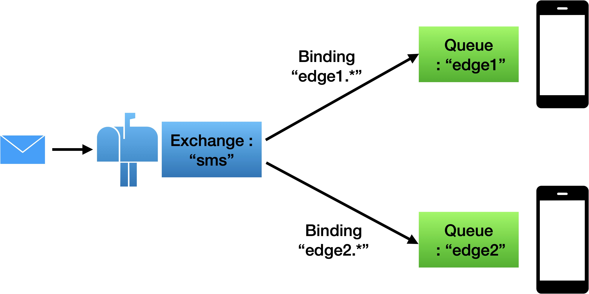
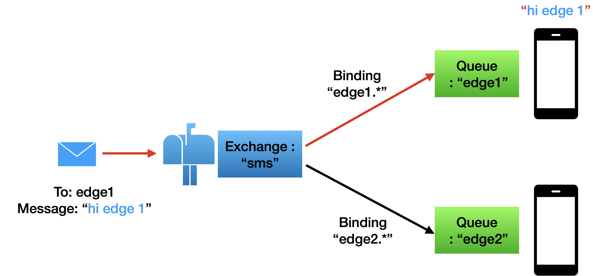

# RabbitMQ

- 메시지 전달 브로커 기술
- {Exchange, Queue, Binding}의 개념을 이해하면 사용법이 명확합니다.
- Exchange는 전화교환원이나 우체국을 연상할 수 있습니다.
- 메시지를 우체국에서 보내면 목적지로 가듯이 Exchange에 메시지를 보내면 원하는 곳으로 메시지를 보낼 수 있습니다.
- Queue는 메시지의 임시 보관 장소입니다.
- 메시지가 목적지에 가기전에 이곳에 모이고, 순차적으로 목적지로 전달됩니다.  
- Binding은 Exchange와 Queue를 연결하는 과정입니다.
- 원하는 경로를 만들어 낼 수 있습니다. 이는 라우팅이라는 용어로 표현될 수 있습니다.
- 상기의 메시지 전달 메커니즘은 rabbitmq를 직접 설치하고 나서, 설치된 프로그램에서 제공하는 rabbitmqadmin이라는 CLI 프로그램을 사용해 보면 이해가 쉽게 됩니다.


## Kafaka vs. RabbitMQ vs. MQTT ?

### Kafaka

- {대용량, 실시간} 로그 처리에 특화된 메시징 시스템입니다.
- 대용량의 streaming, 파이라인등을 이용 시 적합합니다.
- 통상 이벤트 스토어, 히스토리 같은 순서 보장시 사용합니다.
- [+] 타 메시징 시스템 대비 TPS(Transaction Per Second)가 매우 우수
- [+] AMQP 프로토콜이나 JMS API를 사용하지 않고 단순 헤더 정보로 TCP 기반 프로토콜을 사용하므로 단순합니다. 
- [+] 다수의 메시지를 batch 형태로 Broker에게 한번에 전달 가능합니다.
- [+] 큐의 기능은 RabbitMQ, JMS등에 비해 많이 부족하지만, 대용량 메시지 처리가 최대 장점입니다.
- [+] 메시지를 파일로 저장합니다. 시스템 장애시에 복구 가능합니다.
- [+] 메시지 전송 순서가 보장됩니다.
- [-] 성능에 특화되어 다른 범용 메시징 시스템에서 제공하는 유용한 기능 적다는 것이 단점입니다.


### RabbitMQ
- AMQP 프로토콜을 구현합니다.
- [+] {신뢰성, 안정성, 성능}을 고려한 다양한 기능이 제공됩니다.
- [+] 브로커가 유연하고 다양한 라우팅 설정이 가능합니다.
- [+] (STOMP, MQTT, AMQP)와 같은 종래의 프로토콜들을 지원 해야할때 사용하면 좋습니다.
- [+] 관리자 UI를 제공하여 사용이 편리합니다.
- [+] 다수의 RabbitMQ를 조합하여 클러스터 구축이 가능합니다.
- [+] 상업적 이용 가능한 오픈 소스로 제공됩니다.
- [-] 메시지 전송 순서를 보장하지 않는 것이 단점입니다.


### MQTT

- 초 경량 메시지 큐 프로토콜입니다.
- 발행-구독(Pub/Sub) 방식에 초첨을 두고 있습니다.
- [+] AMQP와 마찬가지로 상호 운용이 가능하며, 단순하고 가볍기 때문에 임베디드 시스템에서 대규모 배포에 매우 적합합니다.
- [-] AMQP 처럼 구독 관리와 메시지 라우팅을 위해 브로커에 의존합니다.

### ZeroMQ

- [+] 중앙 집중형 브로커 없이 메시지 전달 가능합니다.
- [-] 하지만 브로커가 제공하는 영속성 및 전달 보장성은 없습니다.
- [+] 요청-응답(REQ-REP) 패턴, 발행-구독(PUB-SUB) 패턴을 제공합니다.
- [+] PUSH-PULL 방식을 제공하여 단 방향으로 흐르는 데이터 스트림을 다루는데 효과적입니다.
- [+] 가벼습니다.
- [+] 빠릅니다.
- [+] 브로커가 필요 없습니다.
- [+] 상호 운용이 가능합니다.
- [-] 메시지 전송에 대한 신뢰성이 다소 떨어집니다.


## RabbitMQ 설치하기 (Mac)

- brew install

```bash
brew update
brew install rabbitmq
```

- 경로 설정하기

```bash
     export PATH=/opt/homebrew/sbin:$PATH
```

- 관리자 계정추가

```bash
    $ sudo rabbitmqctl add_user rabbitmq password
    $ sudo rabbitmqctl set_user_tags rabbitmq administrator
```

- 관리자 UI 접속하기

```bash
    $ open http://localhost:15672/

    id : rabbitmq
    pw : password
```

- 사용자 확인

```bash
    $ rabbitmqctl list_users
```


## "rabbitmqadmin"으로 만들어 보기

- 참고 주소 : http://corecode.pe.kr/2018/02/04/RabbitMQ_usage/
- 본 예제는 {Exchange, Queue, Binding}의 개념을 이해하기 위한 것이다.
- Exchange는 전화교환원이나 우체국을 연상하면 좋다. 
- Exchange에 메시지를 보내면 목적지까지 간다.
- Queue는 메시지의 임시 보관 장소다. 
- 메시지가 목적지에 가기전에 이곳에 순서대로 모인다.     
- Binding은 Exchange와 Queue를 연결하는 과정이다. 일종의 라우팅을 할 수 있으며, 설정도 다양하게 가능하다.
- 상기 요소들의 개념이해를 위해 rabbitmqadmin CLI 프로그램으로 시험해 본다.
- rabbitmq는 이미 설치되어 있고, 터미널에서 프로그램 실행이 가능하도록 시스템 경로가 설정되어 있음을 가정한다.




### 

- 'sms'라는 Exchange와 'edge1', 'edge2'라는 Queue를 생성한 다음에 'edge1'으로 'hi edge1'이라는 메시지를 보내는 예제이다.




- 먼저 'sms'라는 Exchange 를 생성한다.

```bash
 $ rabbitmqadmin declare exchange name=sms type=topic
exchange declared
```

- 먼저 {'edge1', 'edge2'}라는 Queue 를 생성한다.

```bash
$ rabbitmqadmin declare queue name=edge1
queue declared
$ rabbitmqadmin declare queue name=edge2
queue declared
```

- 생성한 큐 목록을 확인한다.

```bash
$ rabbitmqadmin list queues

+--------+----------+
|  name  | messages |
+--------+----------+
| edge1  | 0        |
| edge2  | 0        |
+--------+----------+
```

- 바인딩을 생성한다.

```bash
$ rabbitmqadmin declare binding source="sms" destination_type="queue" destination="edge1" routing_key="edge1.*"
binding declared
$ rabbitmqadmin declare binding source="sms" destination_type="queue" destination="edge2" routing_key="edge2.*"
binding declared
```

- 바인딩 상태를 확인한다.

```bash
$ rabbitmqadmin list bindings

+--------+-------------+-------------+
| source | destination | routing_key |
+--------+-------------+-------------+
|        | edge1       | edge1       |
|        | edge2       | edge2       |
| sms    | edge1       | edge1.*     |
| sms    | edge2       | edge2.*     |
+--------+-------------+-------------+
```


- rabbitmqadmin 을 사용해서 edge1에 메시지를 보낸다.

```bash
$ rabbitmqadmin publish exchange=sms routing_key="edge1.0" payload="hi edge1"
Message published
```

- 큐 목록을 확인하여 큐에 메시지가 들어 있는지 확인한다.

```bash
$ rabbitmqadmin list queues

+--------+----------+
|  name  | messages |
+--------+----------+
| edge1  | 1        |
| edge2  | 0        |
+--------+----------+
```

- 큐에 메시지가 들어 있는지 확인한다.

```bash
 $ rabbitmqadmin get queue=edge1
+-------------+----------+---------------+----------+---------------+------------------+------------+-------------+
| routing_key | exchange | message_count | payload  | payload_bytes | payload_encoding | properties | redelivered |
+-------------+----------+---------------+----------+---------------+------------------+------------+-------------+
| edge1.0     | sms      | 0             | hi edge1 | 8             | string           |            | True        |
+-------------+----------+---------------+----------+---------------+------------------+------------+-------------+
 $ 
 ```


- python 스크립트로 해당 메시지를 얻어올 수도 있다.

```python
#!/usr/bin/env python
import pika

connection = pika.BlockingConnection(pika.ConnectionParameters(host='localhost'))
channel = connection.channel()

channel.queue_declare(queue='edge1', durable=True)

def callback(ch, method, properties, body):
    print(" [d] Received %r" % body)

channel.basic_consume(queue='edge1', on_message_callback=callback, auto_ack=True)
print('[*] Waiting for messages. To exit press CTRL+C')
channel.start_consuming()

```


- 실행한다.

```bash
$ python 2b_recv_sms.py 
 [*] Waiting for messages. To exit press CTRL+C
   [d] Received b'hi edge1'
```


