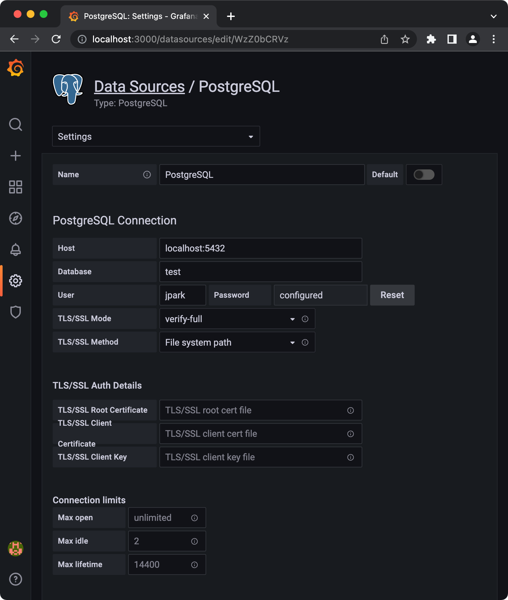

# PostgreSQL 

## 적용 환경 : 
  
  (1) Apple M1 Mac
  (2) [TODO] Ubuntu Linux

## M1 Mac 에서 설치 및 DB 사용법

- 공식 설치 페이지는 아래와 같습니다.

```bash
    https://www.postgresql.org/download/macosx/
```

- 아래 참고문헌에 잘 정리되어 있습니다.

```bash
    https://judo0179.tistory.com/96
```

### 간단한 설치 및 사용법

- Docker가 설치되어 있다면 아래와 같은 명령어로 실행합니다.

```bash
$ docker run --name postgres -e POSTGRES_USER=postgres -e POSTGRES_PASSWORD=postgres -d -p 5432:5432 postgres
```

- 실행중인 컨테이너를 확인합니다.

```bash
    $ docker ps -a | grep postgres
```

- postgres 컨테이너 터미널에 접속합니다.

```bash
    $ docker exec -it postgres /bin/bash
```

- postgres db에 접속합니다.

```bash
    root@ddc8cfd0b03b:/# psql -U postgres
    psql (14.4 (Debian 14.4-1.pgdg110+1))
    Type "help" for help.

    postgres=# 
```

- 슈퍼유저 권한을 갖는 사용자를 만듭니다.
- {id, pw}는 {keti, keti} 입니다.

```sql
    postgres=# CREATE USER keti PASSWORD 'keti' SUPERUSER;
    CREATE ROLE
```

- test database를 만듭니다.

```sql
    postgres=# CREATE DATABASE test OWNER keti;
    CREATE DATABASE
```


- keti 사용자 권한으로, test DB를 선택합니다.

```bash
    postgres=# \c test keti
    You are now connected to database "test" as user "keti".
    test=# 
```

- sensordata라는 테이블을 생성합니다.

```sql
    test=# CREATE TABLE sensordata (
        ts TIMESTAMPTZ NOT NULL DEFAULT NOW(),
        data0 text NOT NULL,
        data1 character varying(32),
        data2 integer,
        data3 integer,
        data4 integer,
        data5 integer
    );
    CREATE TABLE
    test=# 
```

- 만든 테이블을 확인합니다.

```bash
    test=# \dt
            List of relations
    Schema |    Name    | Type  | Owner 
    --------+------------+-------+-------
    public | sensordata | table | keti
    (1 row)

    test=# 
```

### 볼륨 저장소 연동

- 위의 과정을 거치면 docker 컨테이너를 중지하고, 삭제한 상태에서 다시 실행시키면, 만들었던 테이블 정보가 말끔히 사라집니다.
- 이는 원하는 바가 아니므로, 이를 docker volume 을 마운트함으로써 해결하겠습니다.

- 'pgdata'라는 docker volume을 생성합니다.

```bash
    $ docker volume create pgdata
```

- 기존의 postgresql을 위한 docker container를 중지하고, 삭제합니다.

```bash
    $ docker container ps | grep postgres
    $ docker container stop postgres
    $ docker container rm postgres
```

- Docker를 다시 실행합니다. 이때는 생성한 pgdata volume을 마운트 합니다.

```bash
$ docker run --name postgres -e POSTGRES_USER=postgres -e POSTGRES_PASSWORD=postgres -d -p 5432:5432 -d -v pgdata:/var/lib/postgresql/data postgres
```

- postgre container의 bash에 진입합니다.

```bash
    $ docker exec -it postgres /bin/bash
```

- 이전 과정과 같은 순서로 테이블을 만듭니다.

- postgres db에 접속합니다.

```bash
    root@ddc8cfd0b03b:/# psql -U postgres
    psql (14.4 (Debian 14.4-1.pgdg110+1))
    Type "help" for help.

    postgres=# 
```

- 슈퍼유저 권한을 갖는 사용자를 만듭니다.
- {id, pw}는 {keti, keti} 입니다.

```sql
    postgres=# CREATE USER keti PASSWORD 'keti' SUPERUSER;
    CREATE ROLE
```

- test database를 만듭니다.

```sql
    postgres=# CREATE DATABASE test OWNER keti;
    CREATE DATABASE
```


- keti 사용자 권한으로, test DB를 선택합니다.

```bash
    postgres=# \c test keti
    You are now connected to database "test" as user "keti".
    test=# 
```

- sensordata라는 테이블을 생성합니다.

```sql
    test=# CREATE TABLE sensordata (
        ts TIMESTAMPTZ NOT NULL DEFAULT NOW(),
        data0 text NOT NULL,
        data1 character varying(32),
        data2 integer,
        data3 integer,
        data4 integer,
        data5 integer
    );
    CREATE TABLE
    test=# 
```

- 만든 테이블을 확인합니다.

```bash
    test=# \dt
            List of relations
    Schema |    Name    | Type  | Owner 
    --------+------------+-------+-------
    public | sensordata | table | keti
    (1 row)

    test=# 
```

- docker를 중지하더라도 database의 데이터는 남아 있습니다. 

- 일반 콘솔창에서 docker volume 목록을 확인해 보면 더욱 확실합니다.

```bash
    $ docker volume list
```

- docker volume을 상세히 확인도 가능합니다.

```bash
    $ docker volume inspect pgdata
```

- [주의] 생성한 docker volume을 삭제할 수도 있습니다.

```bash
    $ docker volume remove pgdata
```

- [주의] 모든 docker volume을 삭제할 수도 있습니다. 단, 주의가 필요합니다.

```bash
    $  docker volume prune
```


### 로컬 저장소 연동

- 데이터베이스 데이터를 로컬 경로에 마운트할 수도 있습니다. 이 경우에는 버전 관리가 상대적으로 용이할 수 있습니다.

- 'pgdata'라는 폴더를 계정의 홈 디렉토리에 생성합니다.

```bash
    $ mkdir ~/pgdata
```

- 기존의 postgresql을 위한 docker container를 중지하고, 삭제합니다.

```bash
    $ docker container ps | grep postgres
    $ docker container stop postgres
    $ docker container rm postgres
```

- Docker를 다시 실행합니다. 계정의 홈 디렉토리에 생성한 pgdata를 마운트하면서 docker를 실행합니다.

```bash
$ docker run --name postgres -e POSTGRES_USER=postgres -e POSTGRES_PASSWORD=postgres -d -p 5432:5432 -d -v ~/pgdata:/var/lib/postgresql/data postgres
```

- 리눅스의 경우 마운트할 디렉토리의 접근권한 문제로 마운트가 안될 수 있습니다. 아래와 같이 퍼미션을 조절해 줍니다.

```bash
    $ sudo chown -R 200:200 dir_for_mount 
```


- postgre container의 bash에 진입합니다.

```bash
    $ docker exec -it postgres /bin/bash
```

- 이전 과정과 같은 순서로 테이블을 만듭니다.

- postgres db에 접속합니다.

```bash
    root@ddc8cfd0b03b:/# psql -U postgres
    psql (14.4 (Debian 14.4-1.pgdg110+1))
    Type "help" for help.

    postgres=# 
```

- 슈퍼유저 권한을 갖는 사용자를 만듭니다.
- {id, pw}는 {keti, keti} 입니다.

```sql
    postgres=# CREATE USER keti PASSWORD 'keti' SUPERUSER;
    CREATE ROLE
```

- test database를 만듭니다.

```sql
    postgres=# CREATE DATABASE test OWNER keti;
    CREATE DATABASE
```


- keti 사용자 권한으로, test DB를 선택합니다.

```bash
    postgres=# \c test keti
    You are now connected to database "test" as user "keti".
    test=# 
```

- sensordata라는 테이블을 생성합니다.

```sql
    test=# CREATE TABLE sensordata (
        ts TIMESTAMPTZ NOT NULL DEFAULT NOW(),
        data0 text NOT NULL,
        data1 character varying(32),
        data2 integer,
        data3 integer,
        data4 integer,
        data5 integer
    );
    CREATE TABLE
    test=# 
```

- 만든 테이블을 확인합니다.

```bash
    test=# \dt
            List of relations
    Schema |    Name    | Type  | Owner 
    --------+------------+-------+-------
    public | sensordata | table | keti
    (1 row)

    test=# 
```

- docker를 중지하더라도 database의 데이터는 남아 있습니다. 


## M1 Mac 에서 동작중인 postgre 에 데이터 쓰기

- 실행은 하지 않더라도 맥에 postgresql을 설치한다. 파이썬 라이브러리인 psycopg2-binary를 사용하기 위함이다.

```bash
    $ brew install postgresql
```


- psycopg2-binary를 설치한다.

```bash
    $ pip install psycopg2-binary --no-cache-dir
```


- test_insert.py 라는 파이썬 스크립트 파일을 생성한다.

```python
import time, threading
import psycopg2 # postgresql
import random 

def create_table(host, port, user, password, dbname, tablename):
    # create table
    import psycopg2
    conn = psycopg2.connect(database=dbname, user = user, password = password, host = host, port = port)

    cur = conn.cursor()
    cur.execute("CREATE TABLE "+ tablename + "(" + \
        "ts TIMESTAMPTZ NOT NULL DEFAULT NOW(), \
        data0 TEXT NOT NULL);") 
    print ("[+] table created : " + tablename)

    conn.commit()
    conn.close()


def run():
    dbname = 'test'
    user = 'keti'
    password = 'keti'
    host = 'localhost'
    port = 5432
    tablename = "sensordata"

    d = random.randint(1, 1000)
    data = str(d)

    try:
        create_table(host=host, port=port, user=user, password=password, dbname=dbname, tablename=tablename)
    except:
        pass

    conn = psycopg2.connect(database=dbname, user = user, password = password, host = host, port = port)
    cur = conn.cursor()

    cur.execute("INSERT INTO " + tablename + " (DATA0) VALUES ( '" + \
        data +"' )")

    conn.commit()
    print ("[+] insert one : ", data)
    conn.close()

    threading.Timer(5, run).start()

run()
```

- test_insert.py 를 실행한다.

```bash
 $ python test_insert.py
    [+] insert one :  289
    [+] insert one :  568
    [+] insert one :  34
    [+] insert one :  447
    [+] insert one :  877
    [+] insert one :  586
    [+] insert one :  850
    [+] insert one :  460
    [+] insert one :  949
    [+] insert one :  939
    [+] insert one :  308
    [+] insert one :  669
    [+] insert one :  627
    [+] insert one :  228
    [+] insert one :  42
    [+] insert one :  7
    [+] insert one :  919
```


- test_query.py 를 생성한다.

```python
# select
#!/usr/bin/python
import psycopg2

def open_db(tablename):
    dbname = 'test'
    user = 'keti'
    password = 'keti'
    host = 'localhost'
    port = 5432

    conn = psycopg2.connect(database=dbname, user = user, password = password, host = host, port = port)

    return conn


tablename = "sensordata"
conn = open_db(tablename)
cur = conn.cursor()
cur.execute("SELECT ts, data0 from " + tablename)
rows = cur.fetchall()
for row in rows:
   print ("ts = ", row[0])
   print ("data = ", row[1], "\n")

conn.close()

```


- test_query.py 를 실행한다.

```bash
 $ python test_query.py 
ts =  2022-07-26 11:28:15.734705+00:00
data =  289 

ts =  2022-07-26 11:28:20.820175+00:00
data =  568 

ts =  2022-07-26 11:28:25.880465+00:00
data =  34 

 $ python test_query.py
ts =  2022-07-26 11:28:15.734705+00:00
data =  289 
```

## Grafana 연동을 위한 설정

- 앞서의 과정을 통해 postgres DB에 시계열 데이터를 넣는 과정을 완료 했습니다.
- 이를 grafana에서 시각화 하기 위한 조치를 수행합니다.

[TODO]


### PostgreSQL에 대한 SSL/TLS 구성

- PostgreSQL 데이터를 Grafana에서 시각화 할 수 있습니다.
- 이를 위해서는 접근 권한이 필요하며, 아래와 같이 SSL/TLS 구성을 해야 합니다.



- 이와 관련한 적절한 참고문헌은 다음과 같습니다.
- (reference) https://support.ptc.com/help/thingworx/platform/r9/ko/index.html#page/ThingWorx/Help/ThingWorxHighAvailability/configuringssltlsforpostgresql.html

