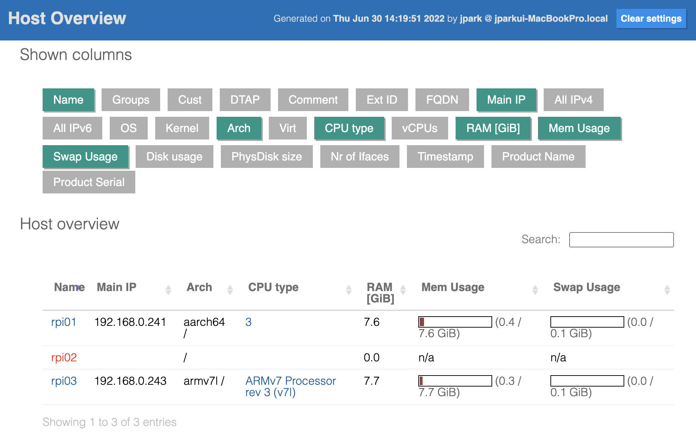
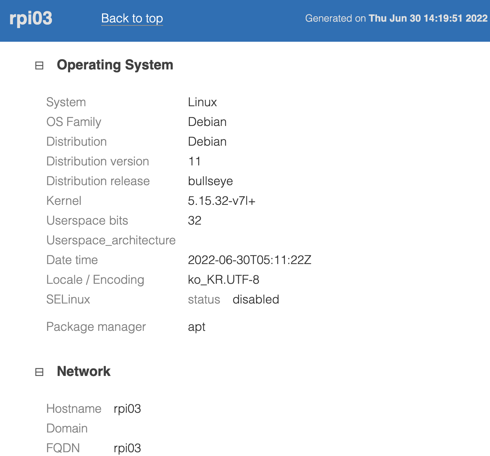

# CMDB 

- 구성관리 데이터베이스 입니다.
- 참고 : https://ansible-cmdb.readthedocs.io/en/latest/usage/

## Mac에서 설치

```bash
$ brew install ansible-cmdb
```

## Quick 사용법


```bash
$ mkdir tmp

$ ansible -i edges.ini edges -m setup --tree tmp/

$ ansible-cmdb tmp/ > tmp/overview.html    

$ open tmp/overview.html
```


## 세부 사용법


### (단계 1) 정보 수집

```bash
$ mkdir tmp.0
$ mkdir tmp.1

$ ansible -i edges.ini edges -m setup --tree tmp.0/
```


### (단계 2 - 1) HTML 파일 생성

```bash
$ ansible-cmdb -t html_fancy tmp.0/ > tmp.1/overview.html    

$ open tmp.1/overview.html
```

- HTML 출력 예시입니다.
- 라즈베리파이 컴퓨터 3대의 정보 {rpi01, rpi02, rpi03} 를 원격에서 수집합니다.
- {rpi01} 은 Arm 64비트 Linux OS가 설치 되었습니다.
- {rpi02}는 네트워크와 연결이 안된 상태입니다.
- {rpi03} 은 Arm 32비트 Linux OS가 설치 되었습니다.





### (단계 2 - 2) CSV 파일 생성

```bash
$ ansible-cmdb -t csv tmp.0/ > tmp.1/overview.csv    

$ open tmp.1/overview.csv
```

### (단계 2 - 3) JSON 파일 생성

```bash
$ ansible-cmdb -t json tmp.0/ > tmp.1/overview.json    

$ open tmp.1/overview.json
```


### (단계 2 - 4) Markdown 파일 생성

```bash
$ ansible-cmdb -t markdown tmp.0/ > tmp.1/overview.md    

$ open tmp.1/overview.md
```


### (단계 2 - 5) SQL 파일 생성

```bash
$ ansible-cmdb -t sql tmp.0/ > tmp.1/overview.sql    

$ open tmp.1/overview.sql
```


### 사용 가능한 출력 템플릿

Ansible-cmdb currently provides the following templates out of the box:

- html_fancy: A dynamic, modern HTML page containing all hosts.
- html_fancy_split: A dynamic, modern HTML page with each host's details in a separate file.
- txt_table: A quick text table summary of the available hosts with some minimal information.
- json: Dumps all hosts including groups, variable, custom info in JSON format.
- csv: The CSV template outputs a CSV file of your hosts.
- markdown: The Markdown template generates host information in the Markdown format.
- sql: The SQL template generates an .sql file that can be loaded into an SQLite or MySQL database.


## 고급 옵션

### 컬럼 필터링

- 특정 컬럼 정보만 선택하여 추출 가능
```bash
$ ansible-cmdb -t txt_table --columns name,os,ip,mem,cpus tmp.0/  > tmp.1/overview.txt

$ open tmp.1/overview.txt
```

- 특정 컬럼 정보만 빼고 추출 가능
```bash
$ ansible-cmdb -t html_fancy \
             --exclude-cols comment,groups,mem_usage,arch,swap_usage,disk_usage,physdisk_size \
             -i edges.ini \
             tmp.0/ > tmp.1/overview.html

$ open tmp.1/overview.html
```