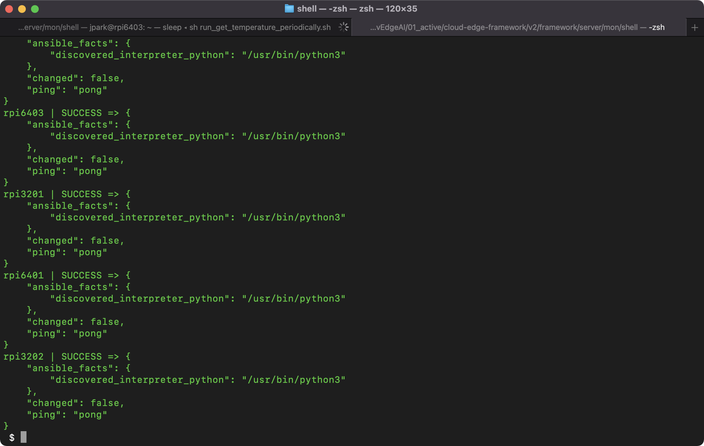
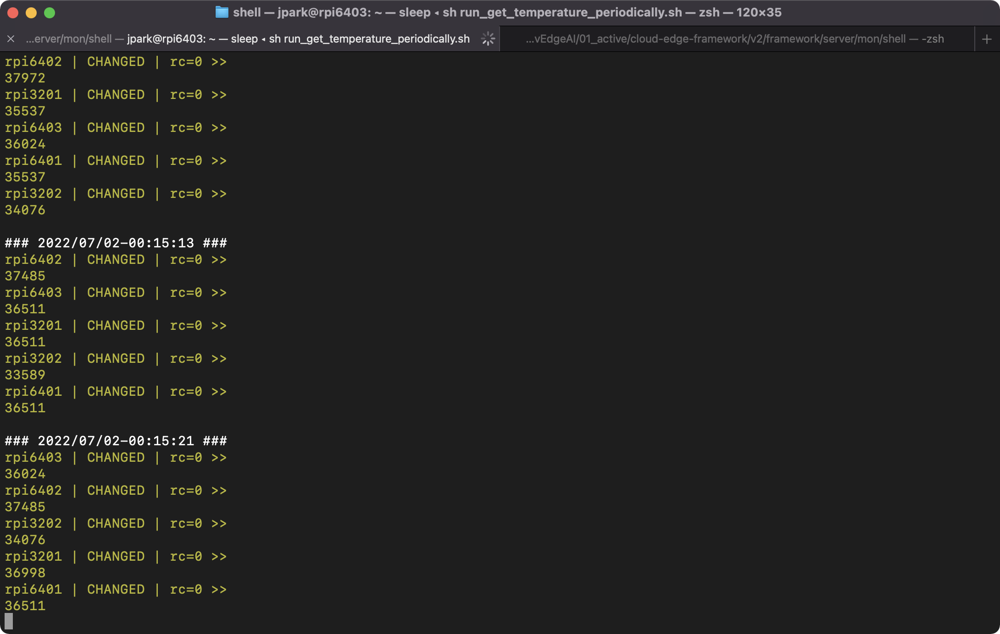
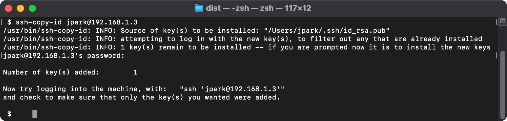
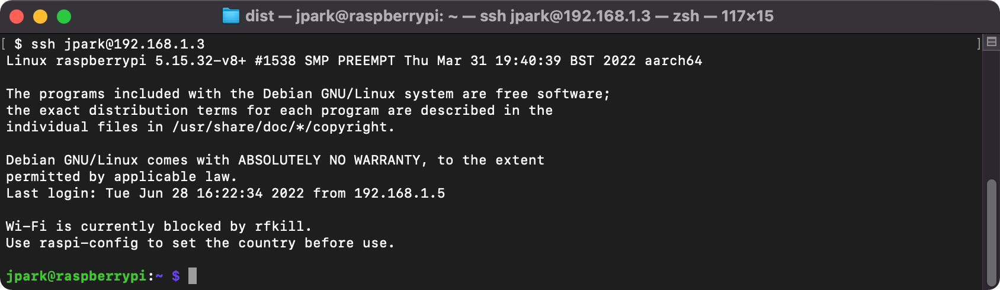
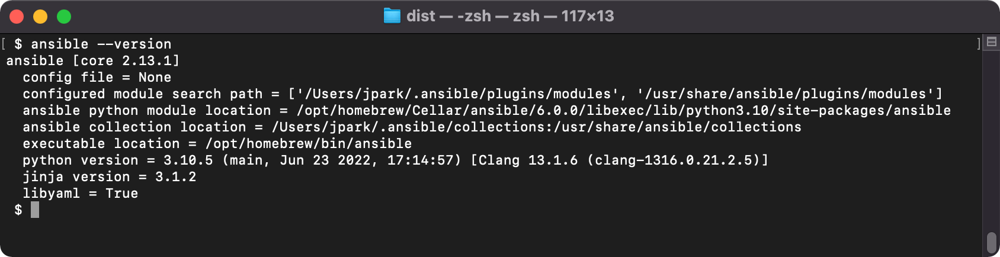
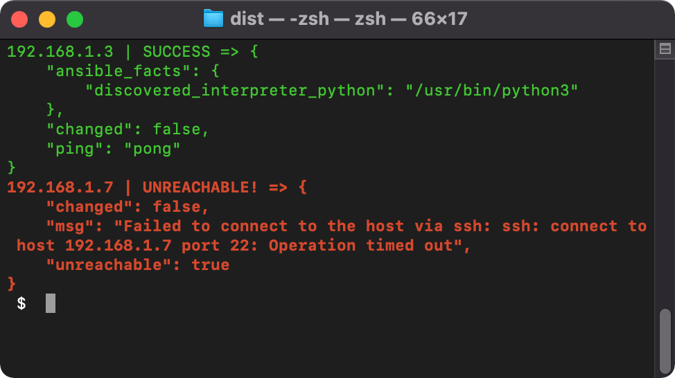
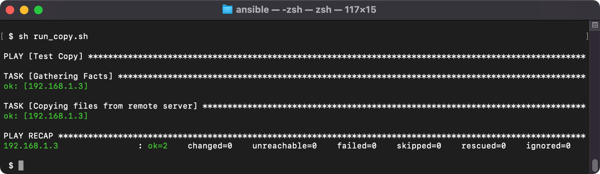
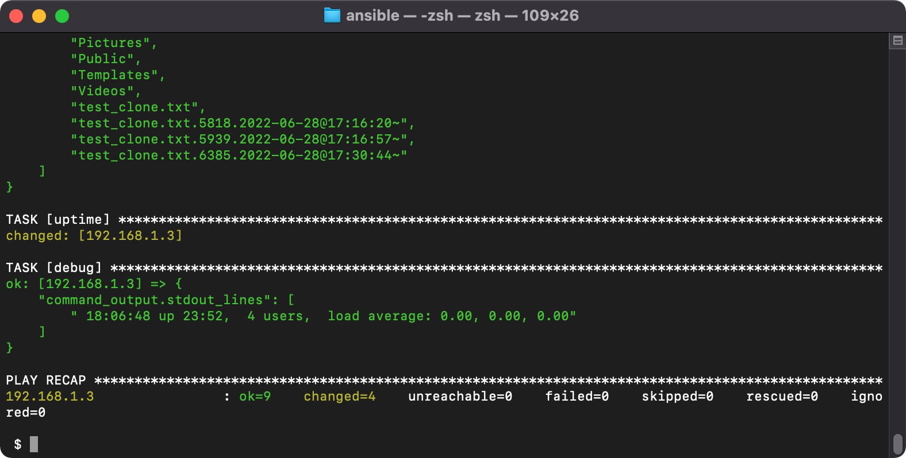

# Monitoring Backend

## 작성

- by : JPark @ KETI
- since : 2022-06-08


## Examples

- 연동 서버 동작 확인




- 주기적인 온도 측정




# 내용

## 설치

- Python 환경
```bash
$ pip install ansible
# 설치 할 앤서블 버전 설정
$ pip install ansible==2.10.7
```

- Ubuntu Linux
```bash
$ sudo apt install ansible
```

- MacOS
```bash
$ brew install ansible
```

## SSH 연결 사전 설정

### 절차

- 단계 1. ssh-keygen으로 키를 생성하고,
- 단계 2. ssh-copy-id로 키를 추가합니다.

### 예시

- 동일 네트워크에 2대의 컴퓨터 {A, B}가 있다고 가정합니다.
- A 는 "192.168.1.5" IP를 갖는다고 하고,
- B 는 "192.168.1.3" IP를 갖는다고 가정합니다.
- B 의 사용자 id는 "jpark"이라고 가정합니다.

- A에서 ssh-keygen으로 먼저 키를 생성합니다.
```bash
$ ssh-keygen -t rsa
```

- A에서 생성한 공개키를 B로 전송합니다.
```bash
$ ssh-copy-id jpark@192.168.1.3
```


- A에서 B로 접속합니다.
- A의 공개키를 B에 전달했기 때문에 A에서 B로 접속시, 암호 입력 없이 접속 가능합니다.

```bash
$ ssh jpark@192.168.1.3
```



## Ansible 사용해보기

### ping으로 연결상태 확인하기

- Ansible 이 설치되어 있는지 확인합니다.

```bash
$ ansible --version
```



- server.ini 파일을 만듭니다.

```bash
$ vi server.ini
```

- server.ini 파일에 서버 목록을 기입합니다.
- 아래 예시에서는 192.168.1.3 은 존재하는 서버지만, 192.168.1.7 은 존재하지 않는 서버입니다.

```bash
[server]
192.168.1.3
192.168.1.7
```

- 터미널에서 ansible을 통해 ping을 실행합니다.

```bash
ansible server -i server.ini -m ping
```




- ansible을 통해 ping을 실행시에 사용자 명을 옵션으로 줄 수 있습니다.

```bash
ansible server -i server.ini -m ping -jpark
```


### localhost에서 원격지 컴퓨터로 파일 복사하기 


- copy.yaml 파일을 작성합니다.

```yaml
- name: Test Copy
  hosts: all
  remote_user: jpark
  tasks:
    - name: Copying files from remote server
      copy:
        src: "test.txt"
        dest: "/home/jpark/test_clone.txt"
        backup: yes
```

- copy.yaml 파일을 실행합니다.


```bash
$ ansible-playbook copy.yaml -i server.ini
```




### localhost에서 원격지 컴퓨터에 명령어를 실행하고 stdout 결과를 확인하기 


- shell_cmd01.yaml 파일을 작성합니다.

```yaml
# This playbook runs a basic DF command.
- hosts: 192.168.1.3
  remote_user: jpark

  tasks:
  - name: find disk space available.
    command: df -hPT
    register: command_output
  - debug:
      var: command_output.stdout_lines

  - name: ls -al
    command: 'ls -al'
    register: command_output
  - debug:
      var: command_output.stdout_lines

  - name: ls
    shell: 'ls'
    register: command_output
  - debug:
      var: command_output.stdout_lines

  - name: uptime
    shell: 'uptime'
    register: command_output
  - debug:
      var: command_output.stdout_lines
```

- shell_cmd01.yaml 파일을 실행합니다.


```bash
$ ansible-playbook shell_cmd01.yaml -i server.ini
```




