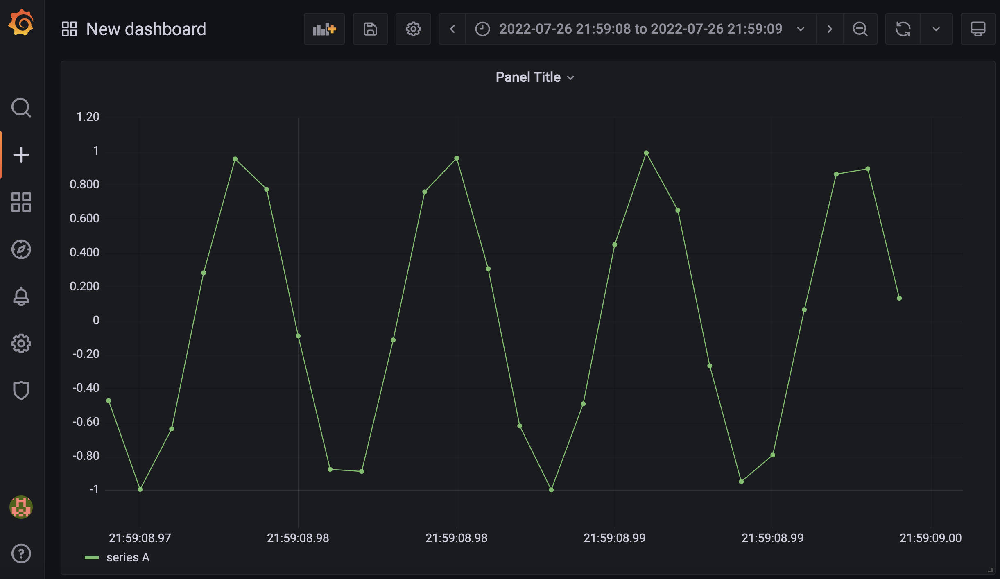

# Visulaization Server

- Demo : http://ketiabcs.iptime.org:39080


## Docker 기반 실행

- 아래의 도커 허브 문서를 참고합니다.

```bash
    https://hub.docker.com/r/grafana/grafana
```

- 아래와 같이 실행합니다.

```bash
    $ docker run -d --name=grafana -p 3000:3000 grafana/grafana
```


- 하지만 위와 같이 실행하면 dashboard가 로딩되거나 저장되지 않습니다.

```bash
version: "3"
services:
  grafana:
    image: grafana/grafana-oss
    container_name: grafana
    ports:
      - 3000:3000
    volumes:
      - grafana-storage:/var/lib/grafana
    restart: always
volumes:
  grafana-storage:
```


## Install Plugins

- Example

```bash
    $ grafana-cli plugins install corpglory-progresslist-panel
```

```bash
    $ docker run -d --name grafana -p 3000:3000 -v grafana-storage:/var/lib/grafana cognite/grafana-cdf
```

grafana-diagram


### grafana datasource

- 연동 테스트




