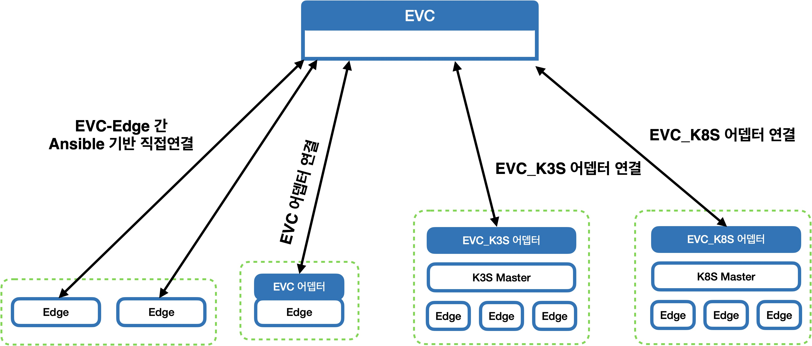

-----------------------------------------------------
# 기술문서

 - 기술문서명 : Edge Vision Cluster(EVC) 상세설계서
 
 - 과제명 : 능동적 즉시 대응 및 빠른 학습이 가능한 적응형 경량 엣지 연동분석 기술개발
 
 - 영문과제명 : Development of Adaptive and Lightweight Edge-Collaborative Analysis Technology for Enabling Proactively Immediate Response and Rapid Learning
 
 - Acknowledgement : This work was supported by Institute of Information & communications Technology Planning & Evaluation (IITP) grant funded by the Korea government(MSIT) (No. 2021-0-00907, Development of Adaptive and Lightweight Edge-Collaborative Analysis Technology for Enabling Proactively Immediate Response and Rapid Learning).
 
 - 작성자 : 박종빈
-----------------------------------------------------

## 문서의 개요

- 본 문서는 Edge Vision Cluster(EVC) 상세설계서 입니다.
- EVC는 클라우드와 에지가 연동하여 비전 처리와 관련한 학습 및 추론을 지원하기 위한 목적으로 개발하고 있습니다.


## EVC의 필요성

### 에지 컴퓨팅

- 에지 컴퓨팅(Edge Computing)은 데이터가 발생하는 현장이나 이러한 데이터소스(Data source) 인근에 에지 디바이스(edge device)가 위치하여 필요한 데이터 처리를 빠르게 수행하는 분산연산처리 방식의 일종입니다. 

- 연산 처리 결과만을 원격지 컴퓨팅 노드들과 공유하거나, 네트워크 연결 없이도 독립적 연산처리를 지원하여 종래의 중앙 집중형 연산처리 방법에 비해 빠른 응답성, 낮은 지연시간, 네트워크 비용 및 전송 시간 절감을 기대할 수 있습니다.

- 이러한 에지 컴퓨팅은 스마트 시티, 스마트 홈, 자율주행차 등 다양한 분야에서 활용할 수 있고, 분산 컴퓨팅, 머신러닝, 인공지능 등 다양한 기술과도 융합 가능합니다.

- 그러나 에지 연산 자원들은 물리적, 논리적으로 서로 분산되어 있고, 기기의 종류도 서로 다를 수 있으므로 기계학습을 수행하고 적절한 응용 기술을 적용하기 위한 새로운 문제점들도 대두됩니다.

- 예컨대, 고성능 클라우드 환경에서는 자원 할당, 연산환경 프로비저닝, 모니터링 및 관리를 중앙에서 일괄 수행하여 접근성, 안정성, 편의성이 높았지만, 이종의 에지 기기로 구성된 상태에서 분산 학습환경을 구축하고, 학습과정을 지속적으로 모니터링 하는데에는 상대적으로 제약이 있습니다.


## 컴퓨터 비전 처리와 관련한 에지 컴퓨팅

- 컴퓨터 비전 분야에서도 에지 컴퓨팅 기술이 가진 장점과 단점은 유사하게 존재합니다.

- 에지 컴퓨팅 기술의 가능성과 많은 장점에도 불구하고, 기기들은 물리적으로 분산되어 있고, 네트워크 구성도 이질적이며, 에지 연산자원의 하드웨어 및 소프트웨어 사양도 서로 다른 상황에서 영상과 같은 대용량 데이터를 이용하여 학습이나 추론을 수행하는 과정은 여전히 도전적입니다.

- 대용량 영상 데이터를 물리적으로 나누어 처리하려면 실행 환경을 쉽게 배포할 수 있어야 하며, 연산 처리 상황과 자원 및 리소스 사용량 등을 편리하고 효율적으로 모니터링 할 수 있어야 합니다.


## 에지 컴퓨팅 환경을 위한 EVC 

- EVC는 앞서 기술한 에지 컴퓨팅 구성이 가진 문제점을 해결하여 효과적이고 편리한 컴퓨터 비전 처리를 수행한 프레임워크 기술입니다.

- 구체적으로 EVC가 제공하는 기능 및 특징은 다음과 같습니다.

- 먼저, EVC는 분산된 에지 컴퓨팅 자원들을 쉽게 클러스터로 구축하도록 합니다.

- 예컨데, 네트워크를 통해 제어 가능한 1개 내지 N개의 연산 장치(이후에는 에지 디바이스, 에지 장치, 장치 등으로 표현합니다)가 있을 때 이를 EVC에 등록함으로써 지원하는 연동 프로파일에 따른 클러스터를 구축할 수 있습니다.

- 구축된 클러스터에는 docker나 containerd와 같은 컨테이너화된 런타임 환경을 쉽게 배포할 수 있습니다.

- 또한 소정의 연산처리를 수행하면서 기기 상태를 모니터링할 수 있습니다.

- 구축된 클러스터 별로 특정 기기가 새롭게 추가되거나, 제거되거나, 문제가 발생하여 오작동을 일으키는 경우에도 대응하도록 설계했습니다.

- 이런 연동방법 및 응용기능들은 연동 프로파일과 응용 기능 레벨을 통해 확장 개발되고 있습니다.





## 기계학습 모델처리를 수행하는 Edge Vision Framework와의 연동

- EVF(Edge Vision Framework)는 비전처리와 관련한 인공지능 모델을 처리하는 프레임워크입니다.

- EVF는 거대한 크기의 인공지능 모델을 경량 인공지능 모델로 변환할 수 있습니다.

- EVC는 EVF와 RESTFul API를 통해 연동할 수 있습니다.

- (개발 예정) 다음은 RESTFul API 의 예시입니다.


|RESTFul API | col1 | col2 | col3 |
|---|---|---|---|
|내용 1|내용 2|내용 3|내용 4|
|내용 5|내용 6|내용 7|내용 8|
|내용 9|내용 10|내용 11|내용 12|


## EVC 구현

- EVC는 기저 플랫폼(base platform)과 응용 플랫폼(application platform)으로 나누어져 있습니다.
- 4가지 연동 프로파일에 따라 클러스터 구축방식을 선택할 수 있습니다.
- 응용측면에서는 기능 레벨 정의를 통해 프로비저닝, 모니터링, 배포 등을 응용환경에 맞게 활용할 수 있습니다.
- 구현을 위해서는 다양한 오픈소스를 활용했습니다.
- 예컨데, 모니터링을 위해서는 프로메테우스(Prometheus), 시각화는 그라파나(Grafana)를 사용합니다.
- 클러스터 구축 및 프로비저닝을 위해서는 앤서블(Ansible)을 사용합니다.
- 그리고 모델 패키징 및 전달을 위해서는 docker난 containerd와 같은 컨테이너 기술을 사용합니다.


### 기저 플랫폼과 응용 플랫폼

- EVC는 기저 플랫폼(base platform)과 응용 플랫폼(application platform)으로 나누어 설계했습니다.

- todo

  
  
### 앤서블을 통한 느슨하지만 안정적인 연결

- 앤서블(Ansible)은 레드햇에서 개발한 애플리케이션 배포, 서버 프로비저닝, 구성 관리 등 다양한 운영 작업을 자동화하기 위한 도구입니다.

- SSH(Secure Shell)을 통해 원격 서버에서 명령어를 실행하고, YAML 형태의 Playbook을 이용하여 구성 작업을 정의할 수 있습니다.

- 별도의 에이전트를 설치하지 않아도 되어 구성이 단순하고 관리가 용이합니다. 

- 다양한 모듈과 플러그인이 존재하며, 필요한 모듈을 직접 작성하여 사용할 수도 있다는 것이 큰 장점입니다.

- 최근 많은 공개 프로젝트들이 에지 클러스터를 구축하기 위한 프로비저닝, 관리, 모니터링 도구로 앤서블을 채택하고 있습니다.

- 예컨데 NVidia의 DeepOps (https://github.com/NVIDIA/deepops), Kubernetes 클러스터를 구축하기 위한 kubespray (https://github.com/kubernetes-sigs/kubespray) 프로젝트가 대표적이며

- Microsoft Azure Cloud 및 Amazon의 aws EC2에서도 ansible을 사용할 수 있습니다.

- EVC 클라우드 서버는 앤서블을 사용하여 등록된 에지 장치들에게 개발환경 구성과 같은 프로비저닝 처리를 수행합니다.


### 프로메테우스를 사용한 모니터링

- 프로메테우스(Prometheus)는 오픈소스 모니터링 시스템 (https://github.com/prometheus/prometheus)으로써, 

- 컨테이너화된 환경에서의 모니터링을 지원하며, 시계열 데이터를 수집, 저장, 쿼리하는 기능을 제공합니다.

- HTTP, SNMP, DNS 등 다양한 프로토콜을 지원하며, 클라이언트 라이브러리를 통해 애플리케이션에서 지표를 수집할 수 있습니다.

- 그리고 시계열 데이터와 관련하여 지정된 주기로 데이터를 수집하고, 로컬 디스크에 저장할 수도 있습니다. 이를통해 쿼리 결과를 신속히 획득할 수 있으며, 시간이 지나서도 데이터가 유지될 수 있습니다.

- 또한 PromQL이라는 자체 쿼리 언어를 제공하여 저장된 데이터에 쿼리하고 그 결과를 얻어 올 수 있습니다.


### 프로메테우스와 연계한 Exporter 구축

- 기계학습이 수행되고 모니터링 대상이 되는 에지 자원에는 익스포터(Exporter)라는 데이터 수집 모듈이 탑재됩니다.

- 수집한 데이터를 프로메테우스가 처리할 수 있는 형식으로 변환하여 노출하는 역할을 담당합니다. 

- 익스포터는  서버, 네트워크, 디바이스 등에 대한 메트릭을 수집할 수 있으며, 사용자 정의에 따라 확장 가능합니다.

- 익스포터로부터 수집한 각종 메트릭은 프로메테우스 서버가 수집하여 저장하게 됩니다.

- 프로메테우스는 수집된 데이터에서 필요한 데이터를 추출하기 위해 쿼리 기능을 제공하며, 그라파나와 같은 시각화 모듈과의 연계가 편리합니다.

- 예컨대 그라파나는 프로메테우스를 하나의 데이터 소스로 인식하여 기계학습을 수행하는 에지 컴퓨터 상태를 대시보드 및 알림 형태로 제공할 수 있습니다.


### 그라파나 시각화 도구

- 앞서 기술한 프로메테우스(Prometheus) 자체로도 모니터링한 데이터에 대한 쿼리 결과를 시각화 할 수 있지만, 시각화 형식 및 방법이 다소 제한적입니다.

- 따라서 다수의 개발 프로젝트들이 시각화에 특화된 그라파나를 사용하고 있으며, EVC에서도 이와 같은 구성을 따릅니다.

- 그라파나는 여러 데이터소스로부터 데이터를 수집하고, 이를 사용자가 원하는 방식으로 시각화할 수 있다는 것이 매우 큰 장점입니다.

- 예컨대 프로메테우스, 그라파이트(Graphite), 엘라스틱서치(Elasticsearch), 인플럭스DB(InfluxDB)와 같은 데이터베이스와 연동하여 데이터를 가져올 수 있습니다. 

- 전달된 데이터는 그라파나의 시각화 대시보드를 통해 그래프, 표, 경고, 패널 등을 무리지어 나타내고, 필요시 전시 모드 (presentation mode)로 표출하거나, 플러그인 및 사용자 정의 기능을 사용하여 확장할 수 있게 됩니다.


### 도커와 앤서블을 이용한 모니터링 환경 배포

- 이런 모니터링 환경은 docker로 패키징되어 앤서블을 통해 새롭게 등록된 에지 디바이스에 배포됩니다.

- 모니터링 소프트웨어 모듈은 도커를 통해 이미지(Image)라는 패키지로 구성하고 이를 레지스트리(Registry)에 저장하여, API와 같은 처리 요청이 발생하면 앤서블을 통해 목적지로 설정된 엣지 연산 장치에 제공합니다.

- 여기서 도커(Docker)는 컨테이너 기반의 오픈소스 가상화 플랫폼으로써, 컨테이너라고 하는 소프트웨어를 실행하기 위한 격리된 환경을 제공하며, 컨테이너 내부에 애플리케이션과 그에 필요한 모든 종속성을 포함하여 패키징 할 수 있습니다. 따라서 배포와 실행이 용이해집니다.


### K3S

- 경량 쿠버네티스 기술


### K8S 

- 컨테이너 오케스트레이션 기술


## EVC 응용기능 

### 분산학습 (Distributed Learning)

- 연합학습(Federated Learning)과 유사한 학습 방법으로써 다수의 에지 장치가 협력하여 학습을 수행하는 방식입니다.

- 연합학습은 방대한 데이터에 대한 종래의 병렬처리 개념을 벗어나 보안이 강화된 학습도 가능케 합니다.

- EVC는 공개 프로젝트인 FedML()


### 병행추론

- todo (KETI 공인시험인증과 연계)


### 협력추론

- todo


### 엣지 환경을 고려한 모델 추천

- todo


## EVC 사용예시

### (디바이스 등록) 에지 디바이스 사용자 계정 생성

- EVC와 연동하기 위해서는 적절한 사용자 계정이 있어야 합니다.

- 단, 사용자 계정의 권한 설정은 매우 신중해야 합니다.

- 에지 디바이스의 특정 사용자 계정이 정상적으로 EVC에 등록되면, EVC는 사용자 계정이 가진 시스템 권한 만큼 에지 디바이스를 제어할 수 있습니다.

- 예컨데, 에지 디바이스의 root 권한을 가진 사용자 정보를 EVC에 제공한다면, EVC는 에지 디바이스의 root 권한을 위임 받게 됩니다. 혹은 일반 권한을 가진 사용자 정보를 EVC에 제공한다면, EVC는 시스템을 최신 상태로 업데이트 하거나 필요한 패키지를 설치하지 못할 수 있습니다.

- 따라서 어떤 권한을 EVC에 제공할지는 EVC 프레임워크 기술을 사용하려는 사용자의 선택에 달려 있습니다.

- 시스템을 제어할 수 있는 권한이 강할수록 EVC는 많은 강력한 기능을 제공하고 사용자는 편리하게 자신의 에지 디바이스를 클러스터 구성원으로 활용할 수 있지만, 에지 디바이스를 등록한 사용자 입장에서는 시스템의 보안 측면에서 염려도 커질 수 있습니다.

- 반대로 보안을 우려하여 제한된 권한을 가진 사용자 정보를 제공한다면, 그 만큼 사용상의 제한이 따르게 됩니다. 


### (디바이스 등록 단계) EVC 공개키 획득 및 등록

- RESTFul API를 통해 누구나 EVC의 공개키 획득 가능합니다.

- 획득한 EVC의 공개키를 에지 디바이스에 생성한 사용자의 홈 폴더의 ~/.ssh/authorized_keys의 맨 뒤에 추가합니다.

- todo :


### (디바이스 등록 단계) 에지 디바이스 ssh 연결 채널 확보

- EVC는 종래의 사설 네트워크(private network) 환경에서의 에지 클러스터 구축의 한계를 넘어서는 기술입니다.

- 즉, 서로 다른 네트워크들에 존재하는 에지 디바이스들을 함께 처리할 수 있게 합니다.

- 이를 위해서는 EVC가 에지 디바이스에 보안에 강력한 방법으로 접근할 수 있어야 합니다.

- EVC는 ssh (secure shell)을 통해 에지 디바이스에 한명의 사용자처럼 접속할 수 있으며, 사용자가 가진 권한 만큼 시스템을 제어하고 EVC가 제공하는 기능을 발휘 할 수 있습니다.

- todo :


### (디바이스 등록 단계) EVC에 에지 디바이스를 등록합니다.

- EVC에서 제공하는 RESTFul API를 사용하여 에지 디바이스를 등록합니다.

- API의 입력으로는 앞서 준비한 {ssh 연결정보, 사용자 정보}를 입력합니다.

- API를 정상적으로 호출했다면 EVC는 에지 디바이스에 고유한 Token을 발행합니다.

- 이 Token을 통해 EVC는 에지 디바이스를 고유하게 식별합니다.

- todo : 


### (클러스터 구축 단계) 


### (모델 등록 단계)


### (모델 배포 단계)


### (모델 수행 단계)


### (디바이스 모니터링 단계)


## 시스템 설치 방법

- TODO


----------------------
## 시스템 구현

- 본 절에서는 EVC를 구축하는 상세한 방법을 기술합니다.

- 향후에는 컨테이너 기반으로 패키징하여 다음의 절차를 따르지 않아도 설치가 가능하도록 변경될 것입니다.


### 앤서블 설치

- Python PIP

```bash
$ pip install ansible
# 설치 할 앤서블 버전 설정
$ pip install ansible==2.10.7
```

- Python conda

```bash
$ conda install ansible
```

- Ubuntu Linux
```bash
$ sudo apt install ansible
```

- MacOS
```bash
$ brew install ansible
```

#### SSH 연결 사전 설정

##### 절차

- 단계 1. ssh-keygen으로 키를 생성하고,
- 단계 2. ssh-copy-id로 키를 추가합니다.

##### 예시

- 네트워크에 2대의 컴퓨터 {A, B}가 있다고 가정합니다.
- A 는 "192.168.1.5" IP를 갖는다고 하고,
- B 는 "192.168.1.3" IP를 갖는다고 가정합니다.
- B 의 사용자 id는 "jpark"이라고 가정합니다.

- A에서 ssh-keygen으로 먼저 키를 만듭니다.
```bash
$ ssh-keygen -t rsa
```

- private key(비밀키)와 public key(공개키)가 짝으로 만들어집니다.

- A에서 만든 공개키를 B로 전송합니다.
- A의 공개키 ~/.ssh/id_rsa.pub 의 내용이 B에 전달되어 B의 ~/.ssh/authorized_keys 파일에 추가됩니다.

```bash
$ ssh-copy-id jpark@192.168.1.3
```


- A에서 B로 암호 입력 없이 접속 가능합니다.

```bash
$ ssh jpark@192.168.1.3
```


#### Ansible 사용해보기

##### ping으로 연결상태 확인하기

- Ansible 이 설치되어 있는지 확인합니다.

```bash
$ ansible --version
```


- server.ini 파일을 만듭니다.

```bash
$ vi server.ini
```

- server.ini 파일에 서버 목록을 기입합니다.
- 아래 예시에서는 192.168.1.3 은 존재하는 서버지만, 192.168.1.7 은 존재하지 않는 서버입니다.

```bash
[server]
192.168.1.3
192.168.1.7
```

- 터미널에서 ansible을 통해 ping을 실행합니다.

```bash
ansible server -i server.ini -m ping
```


- ansible을 통해 ping을 실행시에 사용자 명을 옵션으로 줄 수 있습니다.

```bash
ansible server -i server.ini -m ping -jpark
```


##### localhost에서 원격지 컴퓨터로 파일 복사하기 


- copy.yaml 파일을 작성합니다.

```yaml
- name: Test Copy
  hosts: all
  remote_user: jpark
  tasks:
    - name: Copying files from remote server
      copy:
        src: "test.txt"
        dest: "/home/jpark/test_clone.txt"
        backup: yes
```

- copy.yaml 파일을 실행합니다.


```bash
$ ansible-playbook copy.yaml -i server.ini
```


##### localhost에서 원격지 컴퓨터에 명령어를 실행하고 stdout 결과를 확인하기 


- shell_cmd01.yaml 파일을 작성합니다.

```yaml
# This playbook runs a basic DF command.
- hosts: 192.168.1.3
  remote_user: jpark

  tasks:
  - name: find disk space available.
    command: df -hPT
    register: command_output
  - debug:
      var: command_output.stdout_lines

  - name: ls -al
    command: 'ls -al'
    register: command_output
  - debug:
      var: command_output.stdout_lines

  - name: ls
    shell: 'ls'
    register: command_output
  - debug:
      var: command_output.stdout_lines

  - name: uptime
    shell: 'uptime'
    register: command_output
  - debug:
      var: command_output.stdout_lines
```

- shell_cmd01.yaml 파일을 실행합니다.


```bash
$ ansible-playbook shell_cmd01.yaml -i server.ini
```


### Grafana 설치  


- 참고주소 : https://grafana.com/

#### Ubuntu 20.04 LTS에서 apt-get을 이용한 설치 방법

- 아래 주소 참고하여 진행
```bash
    https://computingforgeeks.com/how-to-install-grafana-on-ubuntu-linux-2/
```

- 방화벽 열기

```bash
    $ sudo iptables -I INPUT 1 -p tcp --dport 3000 -j ACCEPT
```

#### docker를 이용한 설치

- 아래 주소 문서를 참고하여 Grafana opensource version을 설치합니다.

```bash
https://grafana.com/docs/grafana/latest/setup-grafana/installation/docker/
```

- Grafana grafana/grafana-oss 설치 방법

```bash
docker run -d -p 3000:3000 grafana/grafana-oss
```

- 기본 접속 정보

```bash
    기본 포트: 3000
    기본 ID: admin
    기본 PW: admin
```


#### Grafana 사용팁

##### iframe 으로 웹페이지 넣기

- grafana.ini 파일을 열기 
```bash
$ sudo vi /etc/grafana/grafana.ini
```

- 아래와 같이 편집하기 

```
allow_embedding = true
disable_sanitize_html = true

[auth.anonymous]
enabled = true
org_name = Main Org
org_role = Viewer
```

- 서비스 재시작 하기 (Ubuntu의 경우)

```bash
$ sudo systemctl restart grafana-server
```


- 서비스 동작상태 확인하기 (Ubuntu의 경우)

```bash
$ sudo systemctl status grafana-server
```

- 그라파나 HTML UI / 방패 아이콘 / Settings / "allow_embedding" 찾기

- allow_embedding 이 true인지 확인 


##### 콘솔 명령어로 플러그인 설치하기

- 예를들어, diagram, ajax 플러그인 설치시

```bash
    $ grafana-cli plugins install jdbranham-diagram-panel # DIAGRAM
    $ grafana-cli plugins install ryantxu-ajax-panel # AJAX
    $ grafana-cli plugins install marcusolsson-csv-datasource # CSV

    grafana-cli plugins install innius-video-panel # Video
```

```bash
    $ sudo systemctl restart grafana-server
    $ sudo systemctl status grafana-server
```

