-----------------------------------------------------
# 기술문서

 - 기술문서명 : Edge Vision Cluster(EVC) 상세설계서
 
 - 과제명 : 능동적 즉시 대응 및 빠른 학습이 가능한 적응형 경량 엣지 연동분석 기술개발
 
 - 영문과제명 : Development of Adaptive and Lightweight Edge-Collaborative Analysis Technology for Enabling Proactively Immediate Response and Rapid Learning
 
 - Acknowledgement : This work was supported by Institute of Information & communications Technology Planning & Evaluation (IITP) grant funded by the Korea government(MSIT) (No. 2021-0-00907, Development of Adaptive and Lightweight Edge-Collaborative Analysis Technology for Enabling Proactively Immediate Response and Rapid Learning).
 
 - 작성자 : 박종빈
-----------------------------------------------------

## 문서의 개요

- 본 문서는 Edge Vision Cluster(EVC) 상세설계서 입니다.
- EVC는 클라우드와 에지가 연동하여 비전 처리와 관련한 학습 및 추론을 지원하기 위한 목적으로 개발하고 있습니다.


## EVC 접속 주소

- 빠른 확인을 위해 EVC 서버는 아래 주소로 접근 가능합니다.
- 개발자용 ID/PW 는 {test, test} 입니다.
- http://evc.re.kr __(현재 개발중입니다)__


## EVC의 필요성

### 에지 컴퓨팅

- 에지 컴퓨팅(Edge Computing)은 데이터가 발생하는 현장이나 이러한 데이터소스(Data source) 인근에 에지 디바이스(edge device)가 위치하여 필요한 데이터 처리를 빠르게 수행하는 분산연산처리 방식의 일종입니다. 

- 연산 처리 결과만을 원격지 컴퓨팅 노드들과 공유하거나, 네트워크 연결 없이도 독립적 연산처리를 지원하여 종래의 중앙 집중형 연산처리 방법에 비해 빠른 응답성, 낮은 지연시간, 네트워크 비용 및 전송 시간 절감을 기대할 수 있습니다.

- 이러한 에지 컴퓨팅은 스마트 시티, 스마트 홈, 자율주행차 등 다양한 분야에서 활용할 수 있고, 분산 컴퓨팅, 머신러닝, 인공지능 등 다양한 기술과도 융합 가능합니다.

- 그러나 에지 연산 자원들은 물리적, 논리적으로 서로 분산되어 있고, 기기의 종류도 서로 다를 수 있으므로 기계학습을 수행하고 적절한 응용 기술을 적용하기 위한 새로운 문제점들도 대두됩니다.

- 예컨대, 고성능 클라우드 환경에서는 자원 할당, 연산환경 프로비저닝, 모니터링 및 관리를 중앙에서 일괄 수행하여 접근성, 안정성, 편의성이 높았지만, 이종의 에지 기기로 구성된 상태에서 분산 학습환경을 구축하고, 학습과정을 지속적으로 모니터링 하는데에는 상대적으로 제약이 있습니다.


## 컴퓨터 비전 처리와 관련한 에지 컴퓨팅

- 컴퓨터 비전 분야에서도 에지 컴퓨팅 기술이 가진 장점과 단점은 유사하게 존재합니다.

- 에지 컴퓨팅 기술의 가능성과 많은 장점에도 불구하고, 기기들은 물리적으로 분산되어 있고, 네트워크 구성도 이질적이며, 에지 연산자원의 하드웨어 및 소프트웨어 사양도 서로 다른 상황에서 영상과 같은 대용량 데이터를 이용하여 학습이나 추론을 수행하는 과정은 여전히 도전적입니다.

- 대용량 영상 데이터를 물리적으로 나누어 처리하려면 실행 환경을 쉽게 배포할 수 있어야 하며, 연산 처리 상황과 자원 및 리소스 사용량 등을 편리하고 효율적으로 모니터링 할 수 있어야 합니다.


## 에지 컴퓨팅 환경을 위한 EVC 

- EVC는 앞서 기술한 에지 컴퓨팅 구성이 가진 문제점을 해결하여 효과적이고 편리한 컴퓨터 비전 처리를 수행하게 하는 프레임워크 기술입니다.

- 구체적으로 EVC가 제공하는 기능 및 특징은 다음과 같습니다.

- 먼저, EVC는 분산된 에지 컴퓨팅 자원들을 쉽게 클러스터로 구축하도록 합니다.

- 예컨데, 네트워크를 통해 제어 가능한 1개 내지 N개의 연산 장치(이후에는 에지 디바이스, 에지 장치, 장치 등으로 표현합니다)가 있을 때 이를 EVC에 등록함으로써 지원하는 연동 프로파일에 따른 클러스터를 구축할 수 있습니다.

- 구축된 클러스터에는 docker나 containerd와 같은 컨테이너화된 런타임 환경을 쉽게 배포할 수 있습니다.

- 또한 소정의 연산처리를 수행하면서 기기 상태를 모니터링할 수 있습니다.

- 구축된 클러스터 별로 특정 기기가 새롭게 추가되거나, 제거되거나, 문제가 발생하여 오작동을 일으키는 경우에도 대응하도록 설계했습니다.

- 이런 연동방법 및 응용기능들은 연동 프로파일과 응용 기능 레벨을 통해 확장 개발되고 있습니다.

<br/>
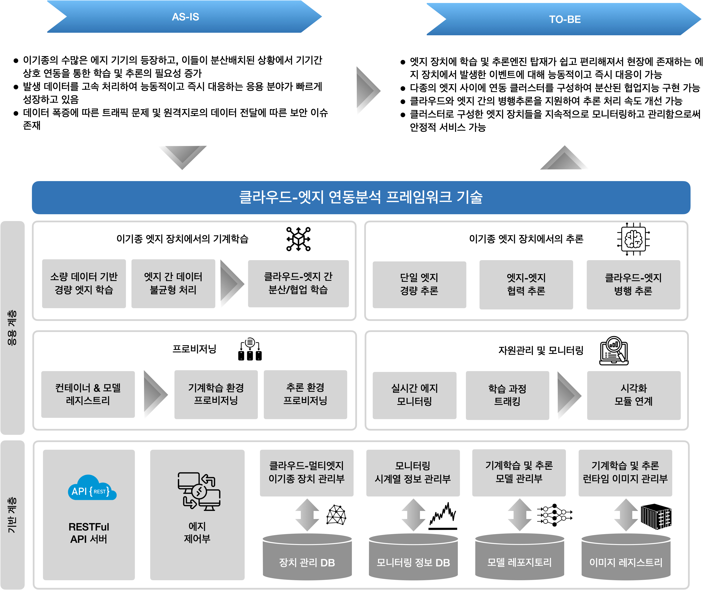


## 기계학습 모델처리를 수행하는 Edge Vision Framework와의 연동

- EVF(Edge Vision Framework)는 비전처리와 관련한 인공지능 모델을 처리하는 프레임워크입니다.

- EVF는 거대한 크기의 인공지능 모델을 경량 인공지능 모델로 변환할 수 있습니다.

- EVC는 EVF와 RESTFul API를 통해 연동할 수 있습니다.

- (개발 예정) 다음은 RESTFul API 의 예시입니다.


|RESTFul API | col1 | col2 | col3 |
|---|---|---|---|
|내용 1|내용 2|내용 3|내용 4|
|내용 5|내용 6|내용 7|내용 8|
|내용 9|내용 10|내용 11|내용 12|


## EVC 구현

- EVC는 기저 플랫폼(base platform)과 응용 플랫폼(application platform)으로 구성됩니다.
- 연동 프로파일에 따라 클러스터 구축방식을 선택할 수 있습니다.
- 응용측면에서는 기능 레벨 정의를 통해 프로비저닝, 모니터링, 배포 등을 응용환경에 맞게 활용할 수 있습니다.
- 구현을 위해서는 다양한 오픈소스를 활용했습니다.
- 예컨데, 모니터링을 위해서는 프로메테우스(Prometheus), 시각화는 그라파나(Grafana)를 사용합니다.
- 클러스터 구축 및 프로비저닝을 위해서는 앤서블(Ansible)을 사용합니다.
- 그리고 모델 패키징 및 전달을 위해서는 docker난 containerd와 같은 컨테이너 기술을 사용합니다.


### 기저 계층과 응용 계층

- EVC는 기저 계층(base layer)과 응용 계층(application layer)으로 나눌 수 있습니다.

- 기반 계층은 외부 어플리케이션들과 연동하기 위한 API 모듈, 디바이스 노드 정보를 관리하는 DB, AI 모델 관리용 레지스트리, Docker 및 Containerd와 같은 컨테이너 관리 레지스트리, 시각화 엔진으로 구성됩니다.

- 응용 계층은 기반 계층 상위에 탑재되어 분석할 모델을 프로비저닝하거나, 분산학습(연합학습), 병행추론, 협력추론 연동엔진을 포함합니다.

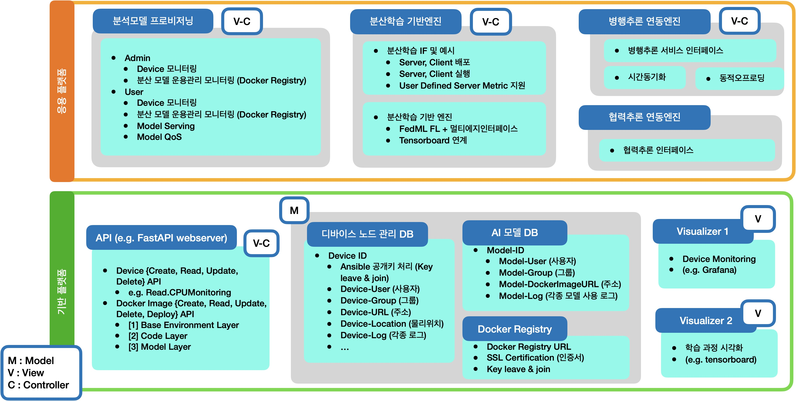


### 연동 프로파일

- EVC는 이종의 에지 장치(edge device)와의 유기적인 연동이 중요합니다.

- 이를 위해 연동 프로파일을 정의하고 이에 따라 EVC와 에지들이 연결됩니다.

- EVC의 연결방식은 다음과 같이 2가지로 구분됩니다.

- 먼저, SSH(Secure Shell)기반의 Ansible을 통해 에지의 정보를 수집하고 비전처리와 관련된 처리를 수행합니다. 여기서 Ansible은 인프라스트럭처 자동화를 위한 오픈 소스 IT 자동화 도구로써, 서버 설정, 배포, 관리 등을 자동화합니다.

- 둘째로, SSH 연결이 곤란한 에지 장치를 고려하여 RESTFul API를 EVC가 제공합니다.

- Ansible을 통한 연동방식은 보다 세부적으로는 {직접 연동}, {EVC 어뎁터 연동}, {EVC_K3S 어뎁터 연동}, {EVC_K8S 어뎁터 연동}으로 구분됩니다.

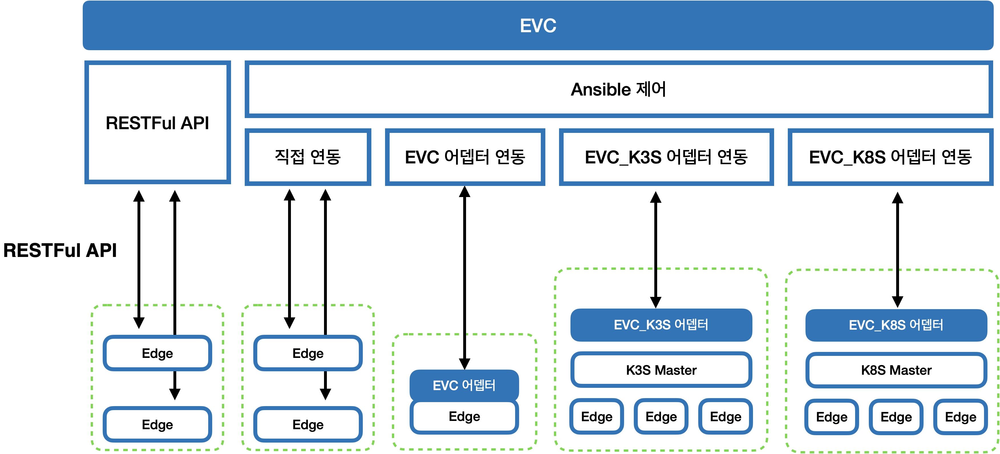

- 이런 연동 방법은 다음 표와 같이 나타낼 수 있으며, 연동 방법을 구체화하고, 기능의 특징과 한계를 규정하기에 도움이 됩니다.

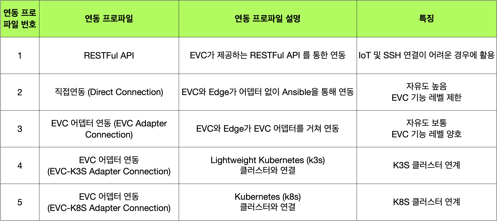


- 예컨데, 이러한 연동 프로파일은 에지 디바이스의 성능을 고려하여 선택할 수 있습니다.

- {RESTFul API} 연동 방식은 초경량에서 고성능 기기에 이르기까지 모두 적용이 가능하고 보안에도 강력한 장점이 있지만, 에지 기기와 EVC가 Polling 방식으로 제어명령 및 데이터를 송수신해야 하는 한계를 가집니다.

- 반면에 Ansible 기반의 연동 방식은 EVC의 다양한 기능을 충분히 적용할 수 있다는 장점은 있지만, SSH를 통한 접근 권한을 EVC에 제공한다는 특징이 존재합니다.

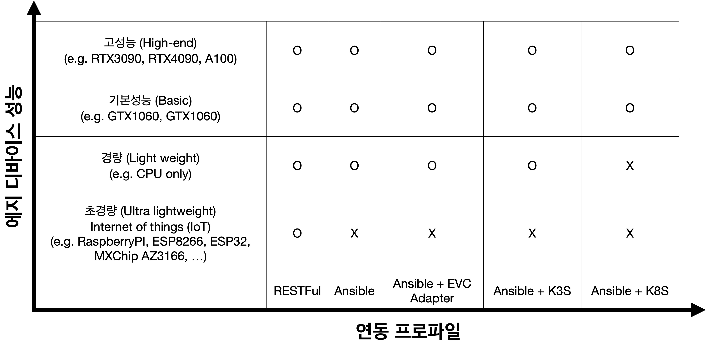


  
### 앤서블을 통한 느슨하지만 안정적인 연결

- 앤서블(Ansible)은 레드햇에서 개발한 애플리케이션 배포, 서버 프로비저닝, 구성 관리 등 다양한 운영 작업을 자동화하기 위한 도구입니다.

- SSH(Secure Shell)을 통해 원격 서버에서 명령어를 실행하고, YAML 형태의 Playbook을 이용하여 구성 작업을 정의할 수 있습니다.

- 별도의 에이전트를 설치하지 않아도 되어 구성이 단순하고 관리가 용이합니다. 

- 다양한 모듈과 플러그인이 존재하며, 필요한 모듈을 직접 작성하여 사용할 수도 있다는 것이 큰 장점입니다.

- 최근 많은 공개 프로젝트들이 에지 클러스터를 구축하기 위한 프로비저닝, 관리, 모니터링 도구로 앤서블을 채택하고 있습니다.

- 예컨데 NVidia의 DeepOps (https://github.com/NVIDIA/deepops), Kubernetes 클러스터를 구축하기 위한 kubespray (https://github.com/kubernetes-sigs/kubespray) 프로젝트가 대표적이며

- Microsoft Azure Cloud 및 Amazon의 aws EC2에서도 ansible을 사용할 수 있습니다.

- EVC 클라우드 서버는 앤서블을 사용하여 등록된 에지 장치들에게 개발환경 구성과 같은 프로비저닝 처리를 수행합니다.

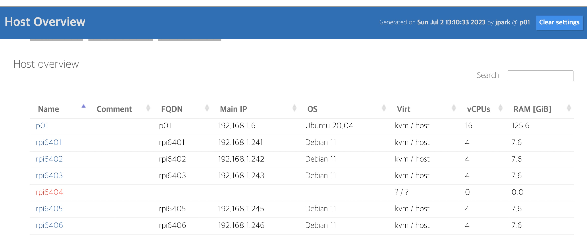

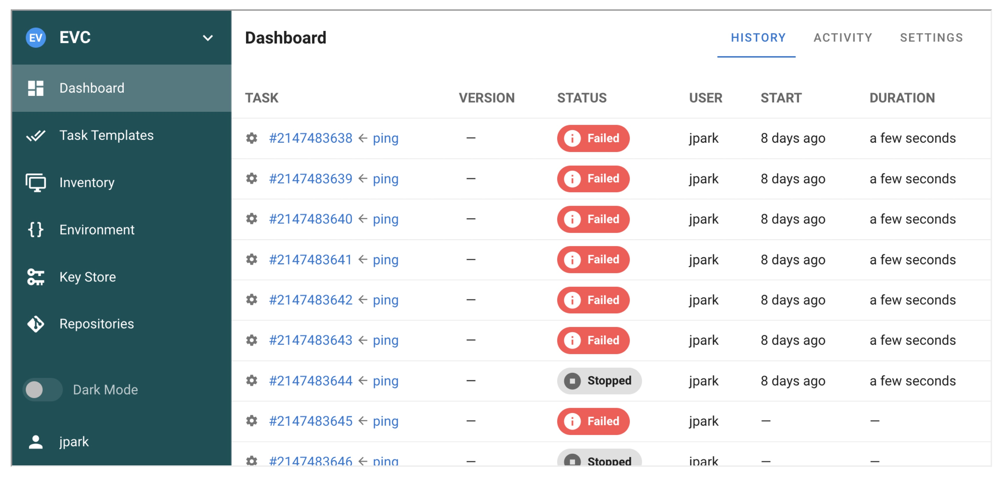


### 프로메테우스를 사용한 모니터링

- 프로메테우스(Prometheus)는 오픈소스 모니터링 시스템 (https://github.com/prometheus/prometheus)으로써, 

- 컨테이너화된 환경에서의 모니터링을 지원하며, 시계열 데이터를 수집, 저장, 쿼리하는 기능을 제공합니다.

- HTTP, SNMP, DNS 등 다양한 프로토콜을 지원하며, 클라이언트 라이브러리를 통해 애플리케이션에서 지표를 수집할 수 있습니다.

- 그리고 시계열 데이터와 관련하여 지정된 주기로 데이터를 수집하고, 로컬 디스크에 저장할 수도 있습니다. 이를통해 쿼리 결과를 신속히 획득할 수 있으며, 시간이 지나서도 데이터가 유지될 수 있습니다.

- 또한 PromQL이라는 자체 쿼리 언어를 제공하여 저장된 데이터에 쿼리하고 그 결과를 얻어 올 수 있습니다.


### 프로메테우스와 연계한 Exporter 구축

- 기계학습이 수행되고 모니터링 대상이 되는 에지 자원에는 익스포터(Exporter)라는 데이터 수집 모듈이 탑재됩니다.

- 수집한 데이터를 프로메테우스가 처리할 수 있는 형식으로 변환하여 노출하는 역할을 담당합니다. 

- 익스포터는  서버, 네트워크, 디바이스 등에 대한 메트릭을 수집할 수 있으며, 사용자 정의에 따라 확장 가능합니다.

- 익스포터로부터 수집한 각종 메트릭은 프로메테우스 서버가 수집하여 저장하게 됩니다.

- 프로메테우스는 수집된 데이터에서 필요한 데이터를 추출하기 위해 쿼리 기능을 제공하며, 그라파나와 같은 시각화 모듈과의 연계가 편리합니다.

- 예컨대 그라파나는 프로메테우스를 하나의 데이터 소스로 인식하여 기계학습을 수행하는 에지 컴퓨터 상태를 대시보드 및 알림 형태로 제공할 수 있습니다.


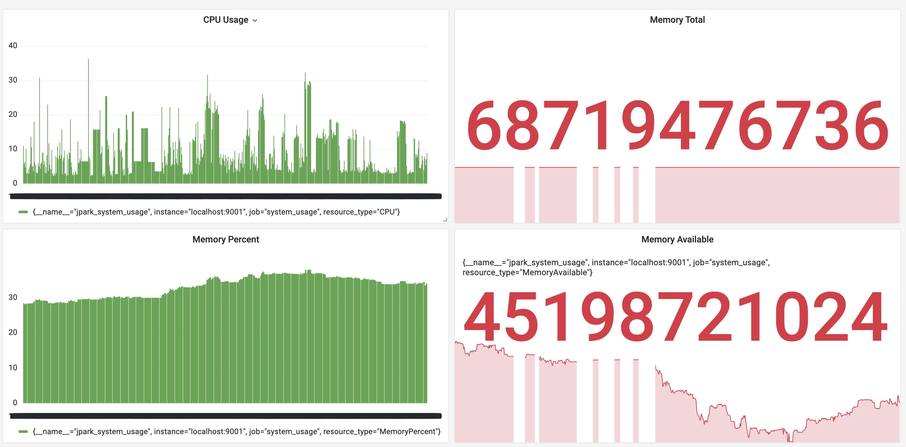


### 그라파나 시각화 도구

- 앞서 기술한 프로메테우스(Prometheus) 자체로도 모니터링한 데이터에 대한 쿼리 결과를 시각화 할 수 있지만, 시각화 형식 및 방법이 다소 제한적입니다.

- 따라서 다수의 개발 프로젝트들이 시각화에 특화된 그라파나를 사용하고 있으며, EVC에서도 이와 같은 구성을 따릅니다.

- 그라파나는 여러 데이터소스로부터 데이터를 수집하고, 이를 사용자가 원하는 방식으로 시각화할 수 있다는 것이 매우 큰 장점입니다.

- 예컨대 프로메테우스, 그라파이트(Graphite), 엘라스틱서치(Elasticsearch), 인플럭스DB(InfluxDB)와 같은 데이터베이스와 연동하여 데이터를 가져올 수 있습니다. 

- 전달된 데이터는 그라파나의 시각화 대시보드를 통해 그래프, 표, 경고, 패널 등을 무리지어 나타내고, 필요시 전시 모드 (presentation mode)로 표출하거나, 플러그인 및 사용자 정의 기능을 사용하여 확장할 수 있게 됩니다.


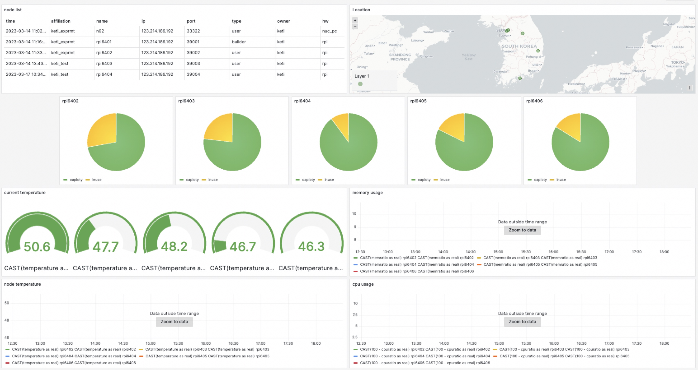


### 도커와 앤서블을 이용한 모니터링 환경 배포

- 이런 모니터링 환경은 docker로 패키징되어 앤서블을 통해 새롭게 등록된 에지 디바이스에 배포됩니다.

- 모니터링 소프트웨어 모듈은 도커를 통해 이미지(Image)라는 패키지로 구성하고 이를 레지스트리(Registry)에 저장하여, API와 같은 처리 요청이 발생하면 앤서블을 통해 목적지로 설정된 엣지 연산 장치에 제공합니다.

- 여기서 도커(Docker)는 컨테이너 기반의 오픈소스 가상화 플랫폼으로써, 컨테이너라고 하는 소프트웨어를 실행하기 위한 격리된 환경을 제공하며, 컨테이너 내부에 애플리케이션과 그에 필요한 모든 종속성을 포함하여 패키징 할 수 있습니다. 따라서 배포와 실행이 용이해집니다.


## EVC 기저계층 기능

- EVC의 기저계층이 제공하는 요소기능은 다음과 같습니다.


### 그룹별 에지노드 접속성 확인 기능

- 제어노드의 접속성 확인
- 초경량 에지노드(라즈베리파이4) 그룹의 접속성 확인
- 고성능 에지노드(GPU 탑재) 그룹의 접속성 확인
- 고성능 및 초경량 에지노드의 운영체제 정보 확인

### 그룹별 에지노드 패키지 업데이트 및 업그레이드 수행 기능

- 초경량 에지노드의 패키지 업데이트 및 업그레이드 수행 확인
- 고성능 에지노드의 패키지 업데이트 및 업그레이드 수행 확인

### 그룹별 에지노드 시간 동기화 기능

- 초경량 에지노드의 시간동기화 수행 확인
- 고성능 에지노드의 시간동기화 수행 확인

### 그룹별 에지노드 모니터링 기능

- 고성능 및 초경량 에지노드의 CPU 온도 측정 기능 확인
- 고성능 및 초경량 에지노드의 CPU 정보 수집 기능 확인
- 고성능 및 초경량 에지노드의 Memory 정보 수집 기능 확인
- 초경량 에지노드의 네트워크 업링크/다운링크 속도 측정 기능 확인
- 고성능 에지노드의 네트워크 업링크/다운링크 속도 측정 기능 확인
- CUDA 지원 GPU 탑재된 에지노드의 GPU 정보 수집 (아래 이미지에서 w01은 GPU SW 환경이 구축된 경우이고, p01은 GPU 사용을 위한 SW환경이 구축되지 않은 경우임)


### 그룹별 에지노드 모델 다운로드 및 docker 빌드 기능

- 모델 리포지토리 (e.g. Github, Gitlab)에 탑재된 모델을 에지노드에 배포하는 기능
- 모델 리포지토리에 탑재된 Dockerfile을 빌드
- evc 자체 docker registry에 빌드한 이미지를 등록
- 에지노드에 docker 설치를 위한 파일 전송


## EVC 응용계층 기능 

### 분산학습 (Distributed Learning)

- 연합학습(Federated Learning)과 유사한 학습 방법으로써 다수의 에지 장치가 협력하여 학습을 수행하는 방식입니다.
- 연합학습은 방대한 데이터에 대한 종래의 병렬처리 개념을 벗어나 보안이 강화된 학습도 가능케 합니다.
- EVC는 공개 프로젝트인 FedML, flower를 지원


### 병행추론

- todo (KETI 공인시험인증과 연계)


### 협력추론

- todo


### 엣지 환경을 고려한 모델 추천

- todo


## EVC 사용예시

- 다음은 EVC를 사용하는 예시를 나타냅니다.

### (EVC user 등록) 사용자 계정 생성 및 로그인

- EVC에 에지장치들을 등록하고 연동클러스터 서비스를 제공받기 위한 사용자 계정을 생성합니다.

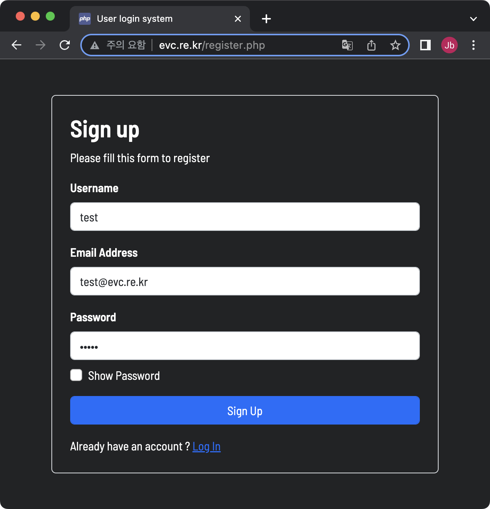

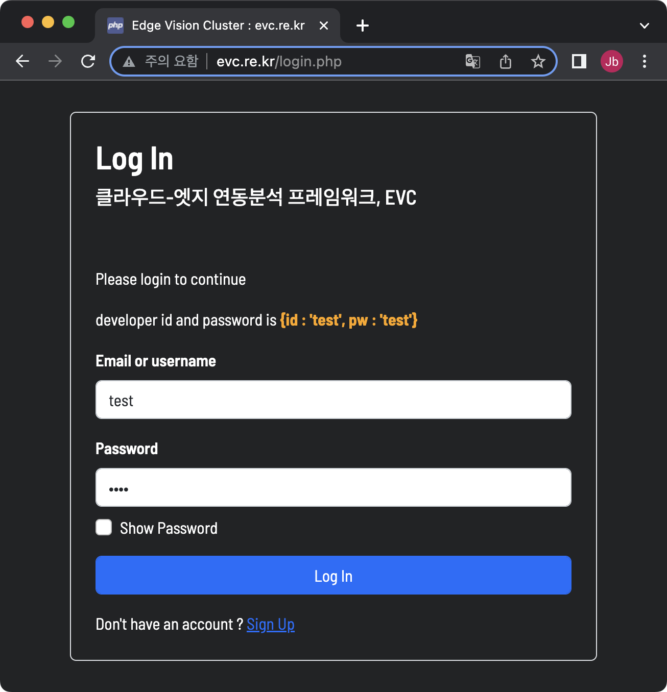


### (EVC device 등록) 에지 디바이스 등록

- 1. 에지 디바이스에서도 적절한 권한의 사용자 계정이 있다고 가정합니다.

- 2. EVC를 통해 서비스 하려는 에지장치(edge device)에 터미널로 진입합니다.

- 3. 아래 명령어를 sudo 권한으로 실행하여 sshd 서버를 설치하고, EVC가 제공하는 공개키를 에지장치에 등록합니다.

```bash
$ wget http://evc.re.kr/newedge.sh -O newedge.sh

$ bash newedge.sh
```

- 4. 에지 장치를 EVC에 등록하기 위한 설정을 수행합니다.

```bash
$ wget http://evc.re.kr/joinedge.sh -O joinedge.sh

$ bash joinedge.sh
```

- 상기 과정을 거치면 EVC 서버를 통해 EVC의 공개키를 획득합니다.
- 그리고 에지 디바이스의 사용자 홈 폴더의 ~/.ssh/authorized_keys 파일에 획득한 공개키를 추가합니다.

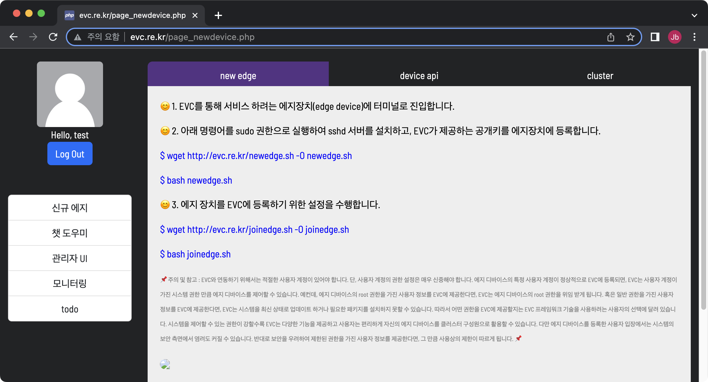


#### (참고) 에지 디바이스의 사용자 권한

> **_-_** 단, 에지 디바이스의 사용자 계정의 권한 설정은 매우 신중해야 합니다.

> **_-_** 에지 디바이스의 특정 사용자 계정이 정상적으로 EVC에 등록되면, EVC는 사용자 계정이 가진 시스템 권한 만큼 에지 디바이스를 제어할 수 있습니다.

> **_-_** 예컨데, 에지 디바이스의 root 권한을 가진 사용자 정보를 EVC에 제공한다면, EVC는 에지 디바이스의 root 권한을 위임 받게 됩니다. 혹은 일반 권한을 가진 사용자 정보를 EVC에 제공한다면, EVC는 시스템을 최신 상태로 업데이트 하거나 필요한 패키지를 설치하지 못할 수 있습니다.

> **_-_** 따라서 어떤 권한을 EVC에 제공할지는 EVC 프레임워크 기술을 사용하려는 사용자의 선택에 달려 있습니다.

> **_-_** 시스템을 제어할 수 있는 권한이 강할수록 EVC는 많은 강력한 기능을 제공하고 사용자는 편리하게 자신의 에지 디바이스를 클러스터 구성원으로 활용할 수 있지만, 에지 디바이스를 등록한 사용자 입장에서는 시스템의 보안 측면에서 염려도 커질 수 있습니다.

> **_-_** 반대로 보안을 우려하여 제한된 권한을 가진 사용자 정보를 제공한다면, 그 만큼 사용상의 제한이 따르게 됩니다. 


#### (참고) ssh를 통한 EVC와 에지 디바이스의 연결 

> **_-_** EVC는 종래의 사설 네트워크(private network) 환경에서의 에지 클러스터 구축의 한계를 넘어서는 기술입니다.

> **_-_** 즉, 서로 다른 네트워크들에 존재하는 에지 디바이스들을 함께 처리할 수 있게 합니다.

> **_-_** 이를 위해서는 EVC가 에지 디바이스에 보안에 강력한 방법으로 접근할 수 있어야 합니다.

> **_-_** EVC는 ssh (secure shell)을 통해 에지 디바이스에 한명의 사용자처럼 접속할 수 있으며, 사용자가 가진 권한 만큼 시스템을 제어하고 EVC가 제공하는 기능을 발휘 할 수 있습니다.


### (디바이스 등록 단계) EVC에 에지 디바이스를 등록합니다.

- EVC에서 제공하는 RESTFul API를 사용하여 에지 디바이스를 등록합니다.

- API의 입력으로는 앞서 준비한 {ssh 연결정보, 사용자 정보}를 입력합니다.

- API를 정상적으로 호출했다면 EVC는 에지 디바이스에 고유한 Token을 발행합니다.

- 이 Token을 통해 EVC는 에지 디바이스를 고유하게 식별합니다.

- todo : 


### (클러스터 구축 단계) 


### (모델 등록 단계)


### (모델 배포 단계)


### (모델 수행 단계)


### (디바이스 모니터링 단계)


